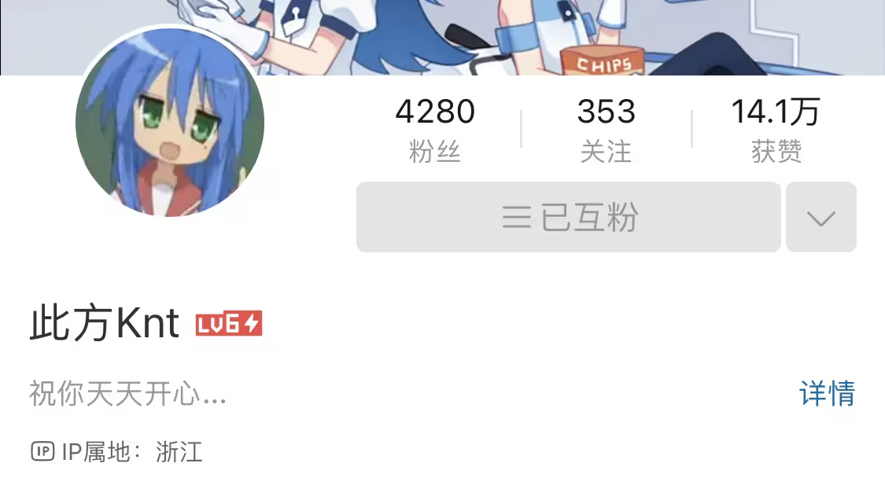
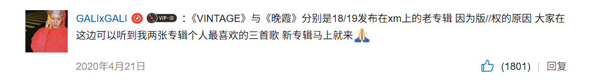
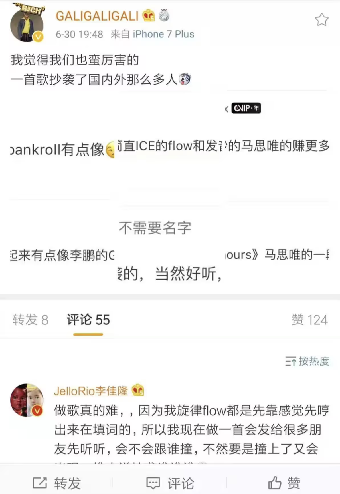
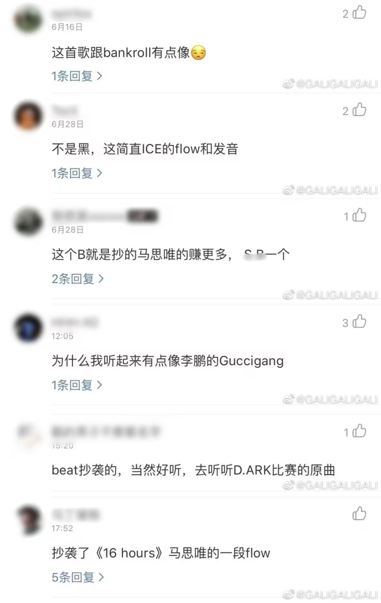

# Gali 开荒文稿初稿

**作者**: 阿菲是Afee

---

今晚20点开始开荒Gali（亚特兰蒂斯之前单独re过直播开荒不听了）

预计三场直播

直播时间：0517/0520/0521

感谢此次文稿撰写者：此方KNT

谢谢粉丝朋友们用爱发电写出如此详细的discography！

 

**GALI** ，本名蒋文涵，1992年4月14日生于上海。

十三四岁时，GALI十分热爱篮球，也因此通过街球Mixtape接触到了说唱音乐。和当时许多国内的爱好者一样，他由此开始逐步了解HIP-HOP音乐。2008年，Kanye让GALI真正爱上了HIP-HOP。

2009年，GALI于大连艺术学院航空服务专业毕业。毕业之初，他一边兼职，一边思考未来的路该怎么走。

**2009-2016年**

在朋友的服装店打工的GALI，渐渐结识了一群喜欢说唱、热爱HIP-HOP的同好。他们对GALI而言，既是顾客，又是朋友。

2010年，受KOZAY等身边玩说唱的一众朋友影响，18岁的GALI正式开始创作说唱。因为小时候爱吃咖喱饭，他给自己取名为GALI。

GALI做了一小段时间音乐，跑演出，收入却寥寥无几。为了维持生计，他在酒吧驻唱了两年，之后两年又到公关公司上班。

其中2013年，MC GALI与蛤小蟆（Hama陈缇）合作演出了 [《带我向前走》​](https://www.bilibili.com/video/BV1oFtZz1ERy?spm_id_from=333.1369.0.0) 。

\*该链接内仅为演出视频，非录音室作品。

但在2016年，GALI终究辞掉了公关的工作，重新回到音乐的怀抱。在体验过那种枯燥乏味的机械生活后，GALI这次更加笃定自己要走做音乐这条路。

2016年

年底，GALI与俞天时KOZAY在上海组建了 **BASE** 厂牌，并于11月1日合作发布第一首单曲 《真棒》​ ，拍摄了[MV](https://www.bilibili.com/video/BV1rs41147Ar)。这个时候就已经出现了一些质疑GALI抄袭的评论。

Kozay同样来自上海，2007年左右开始做说唱，对GALI影响颇深。

2017年

这一年的夏天，GALI和很多rapper一样参加了节目 **《中国有嘻哈》** 。

海选环节，GALI本来已经轻松拿到链子晋级，但因为“发放过多”，链子被节目组强制收回。GALI对此感到十分不爽，认为自己受到了不公正的待遇。

于是，在5月9日，他发布了针对节目的diss **《Illusion Freestyle(C Jamm Remix)》** 。歌曲又名珍珠幻象，remix C Jamm《신기루(illusion)》。

这首diss的热度极高，使GALI获得了大量关注度和粉丝，让很多人第一次知道了GALI这个名字。

\*00:52有敏感词加拿大故人的完整名字，可以在此处把遮住歌词栏并把音量拉低。

6月7日，了子娱乐宣布旗下厂牌BASE正式成立，当时主要有GALI、KOZAY、GoldChild等成员。

6月15日，GALI合作制作人GoldChild金发布歌曲 **《Sober Life》** ，并报名参与了虾米音乐的“寻光计划”。

9月，在僧TV的两期视频里， GALI​ 和 GlodChild​ 分别讲述了《Sober Life》这首歌曲的背景小故事。

GALI：[BV1Dx41147Ru](https://www.bilibili.com/video/BV1Dx41147Ru)

GlodChild：[BV1Dx41147WY](https://www.bilibili.com/video/BV1Dx41147WY)

7月8日，GALI发布歌曲 《Bad City》​ ，歌曲[MV](https://www.bilibili.com/video/BV1Gx41147Yn)的背景是1988年的岛国科幻动画电影《AKIRA》。

7月21日，GALI发布歌曲 《RAMBO》​ **，** 也拍摄了[MV](https://www.bilibili.com/video/BV1Rx411i7aK)。

7月27日，GALI合作吴壹发布歌曲 **《Future Star》** 。\*可直接在网易云内搜索并收听。

9月22日，GALI合作KUAN发布歌曲 **《Obey》** 。\*可在网易云搜索收听。

10月11日，GALI发布歌曲 **《信任问题(Trust Issues)》** 。

11月1日，GALI合作俞天时KOZAY发布歌曲 《成龙》​ （[MV](https://www.bilibili.com/video/BV1wx41177g1)）

\*可在网易云搜索收听。

6月参加完《有嘻哈》节目比赛后，有一些知名度的GALI连续差不多四个月没有怎么休息，不停跑演出。不止节目，虾米的寻光计划也给GALI带来了更大的曝光量和更多的音乐资源。比如11月，GALI在某猫双十一晚会与人合作演出了歌曲 《Sober life (Live)》《山下 (Live)》《Rock The Night (Live)》。​

\*晚会演出视频链接：[BV13qbYzMEip](https://www.bilibili.com/video/BV13qbYzMEip/?t=182)的3:02，晚会演唱的歌曲网易云可收听。但视频有第三方平台图标，歌曲中也有加拿大故人的名字多次出现， **不建议收听、不建议直播观看** 。

11月25日，GALI发布歌曲 **《Mama's Cry》** ，Remix了J Cole的歌曲《Love Yourz》。

2018年

1月10日，GALI合作江映蓉发布歌曲 **《坏天使2.1》** 。\*网易云无音源，QQ音乐可收听。

1月15日，GALI与孙瑄阳参与了说唱组合直火帮专辑中的一首歌曲 **《Anti-social》** 。\*可在网易云搜索收听。

1月15日，GALI合作mFindme发布歌曲 **《Might Be》** 。\*网易云可观看歌词视频，可以不看。

4月19日，GALI合作KUAN发布歌曲 **《For You》** 。\*网易云搜索“KUAN For You”可收听，蓝色封面。歌曲貌似之前也在虾米的寻光计划，后来才在网易云上架。网易云无歌词，没有关联GALI的名字。

- **5月4日，GALI发布了首张个人EP《VINTAGE》** 。

18、19年，GALI在虾米独家先后发布了《VINTAGE》和《晚霞》两张EP，当时虾米音乐还没有倒闭。两张专辑当时也都参加了虾米的“寻光计划”，详细可见两专的简介。

直至20年，GALI才把这两张专辑发布于网易云音乐（可见《1992/Lord Knows》或下张EP歌曲《悲伤飞行》下GALI的评论），但网易云的歌曲顺序和简介的歌曲排序不太一样，推荐按照以下表格（同简介）的歌曲顺序收听。

|  | 歌名 | 歌手 | MV | 备注 |
| --- | --- | --- | --- | --- |
| 1 | Intro | GALI |  |  |
| 2 | Right Now | GALI | [BV1kv4y1o7d3](https://www.bilibili.com/video/BV1kv4y1o7d3) | 网易云已下架无音源 |
| 3 | 1992 / Lord Knows | GALI |  | "1992.即GALI出生的那一年； “当我18岁并没有人看好我”， 18岁即GALI正式开始做说唱的年纪； “直到听到《咬牙切齿》mixtape”， 咬牙切齿是上海OG Naggy的作品，主要活跃于2005-2010年， 这几年也会偶尔发布一些歌曲；当年18岁的GALI， 也正是 在Naggy家写下了他人生中的第一首歌； Summertyme 和 maniac、 T-Sack还有naggy中的其他三人和Naggy活跃的年份相近，但后来都逐渐隐退。" |
| 4 | 晚上七点二十分 (Skit) | GALI |  |  |
| 5 | Action | GALI/MI xin |  |  |
| 6 | Paranoid. | GALI |  |  |
| 7 | Paranoid. (Inst.) | GALI |  |  |
| 8 | Yung Makaveli | GALI |  |  |

5月8日，GALI合作肖恩恩发布歌曲 **《差距》** 。\*可在网易云搜索收听。

7月11日，斗牛APP发布GALI 1分钟采访：嘻哈陪了我8年，我觉得她没做错什么，只是大家对她的解读太过分了（[BV1Es411H76L​](https://www.bilibili.com/video/BV1Es411H76L) ）。

7月，GALI参加《新说唱2018》，早早淘汰。

和未来星合作的[《We The Best》](https://www.bilibili.com/video/BV1Bt4y1u7QU/?t=57)

\*可跳过。如果不跳过，因为直播观看视频可能提示侵权，也可以在网易云搜索并收听。。

8月7日，GALI参与了廖效浓专辑中的歌曲 **《降落》** 。\*可在网易云搜索收听。

8月22日， **GALI合作KenRobb、mac ova seas** 发布歌曲 **《Get Dat(prod.AYNJO)》** 。

当时， **GALI、KenRobb和macovaseas** 都是 **永力兄弟会** 的成员。

8月31日，GALI发布综艺节目 **《这！就是灌篮》** 同名片尾曲。

\*网易云无音源，QQ音乐可收听。

10月6日，GALI参与了孙瑄阳Xtina专辑中的一首歌曲 **《睡前故事》** 。

\*可在网易云搜索收听。

10月15日，GALI参与了张艺兴专辑中的歌曲 **《三昧真火》** 。

\*可在网易云搜索收听。

11月23日，GALI合作王洋EVIS发布歌曲 **《Lover Or Friend》** 。

12月2日，GALI发布单曲 **《SOHO Freestyle》** ，Remix Jaden Smith《SOHO》。

**2019年**

**3月29日，GALI发布了他的第二张EP《晚霞After Light》** 。

\*如果感兴趣，可以阅读一下专辑简介。网易云的歌曲顺序和简介的歌曲顺序不太一样，推荐按照下表（同简介）的歌曲顺序收听。

|  | 歌名 | 歌手 | MV | 备注 |
| :--- | :--- | :--- | :--- | :--- |
| 1 | 建议(ADVICE) | GALI |  |  |
| 2 | 早晨7点20分 | GALI |  |  |
| 3 | Before Sunse / 悲伤飞行 | GALI/李丁丁MIA AIM |  |  |
| 4 | "遥&远" | GALI |  |  |
| 5 | Whippin' | GALI |  |  |
| 6 | 航线 | GALI/HAMA |  |  |

\
4月11日，GALI参与了Gibb-Z黄泽专辑中的歌曲 **《Muchlove》** 。

\*可在网易云搜索收听。

4月22日，GALI参与了90sBABY专辑中的歌曲 **《Smile》** 。

4月24日，Mr.Trouble麻烦先生、Naggy、GALI、AThree合作发布了歌曲 [《Nice To Meet Y'all》​](https://www.bilibili.com/video/BV1KK41157GE%22%20/o%20%22https://www.bilibili.com/video/BV1KK41157GE?spm_id_from=333.1369.0.0) 以及MV（[BV1KK41157GE）](https://www.bilibili.com/video/BV1KK41157GE)

歌曲的 **AThree** 来自新疆，在上海发展了一段时间。 **Naggy** 和 **Trouble** 都是玩得很早的上海说唱歌手，也是影响了GALI的前辈。四人都是好友。

4月26日，GALI与众多说唱歌手合作发布 **[《挑战challenge(刺猬兄弟2019cypher)》](https://www.bilibili.com/video/BV1Ff4y167oU/?t=432)** ，刺猬兄弟是当时新说唱节目四十强必须签约一年的经纪公司。

5月15日，BASE厂牌的GALI、CATI2（2018年，经朋友GALI推荐签约BASE）、俞天时合作发布Cypher 《U.M.F》​ 以及MV（[BV18f4y1x7Cw）](https://www.bilibili.com/video/BV18f4y1x7Cw)

5月19日，GALI发布了歌曲 **《Jaguar (猎豹)》** 。该歌曲收录于一张集结了19位中文说唱歌手的中文说唱音乐合集《壹九》中，可在网易云搜索收听。

6月8日，GALI与栾卓忻发布歌曲 **《Trust Issues (栾卓忻 Remix)》** ，原曲即GALI的《Trust Issues》，主要是在编曲上与原曲不同。\*可在网易云搜索收听。可跳。

6月14日，GALI合作参与了说唱团体古怪因子AYA专辑中的歌曲 **《公园》** 。

古怪因子也是声闻巨匠、Up Gang旗下的说唱团体，有T-clear、52%Vol（凹菠葵）、Qasa（Ayainc）三名成员，现在基本不活跃了。

\*可在网易云搜索收听。

6月20日，GALI合作曾轩发布 **《Drowning》** 。

6月27日，stik(StickBoi)、GALI、JACKWAVY发布歌曲 **《Overdose w/ GALl (prod+JACKWAVY)》** 。

\*可在网易云搜索收听。

6月30日，GALI合作王嗣尧TURBO发布歌曲 **《Auto》** 。

7月6日，GALI发布单曲 《70%》​ （[BV1Mt411G7KA](https://www.bilibili.com/video/BV1Mt411G7KA)），用歌曲回应了多年来各种质疑他“抄袭”的言论，歌词提及了大量他欣赏的同行的名字。

\*视频1:19未消音提到了加拿大故人的原名，建议在那里拉低音量，不过网易云录音室版有消音。

《70%》发布后在圈内的热度极高，不少rapper也都转发或评论了这首歌曲表达了对GALI的支持，比如被cue到的雾都、连麻。

一年后，GALI在《新说唱2020》节目中演唱了这首歌，使得歌曲二次爆火。但在之后的部分采访、直播中，GALI表达了自己并不是很喜欢这首歌的想法。《70%》对他来说，比起歌曲，更像一个小品。

此外，后来这首歌里提到的部分说唱歌手“塌房”，某加拿大故人消音，上节目唱大面积改词，很多人便调侃《70%》是GALI的死亡笔记，GALI后来也在自己的歌词里提了这件事。

10月16日， **GALI** 再次合作了 **macovaseas** 、 **KenRobb** 发布歌曲 《飞檐走壁》​ 和MV（[BV1q44y1679A](https://www.bilibili.com/video/BV1q44y1679A)）。GALI也分别合作了 **肖恩恩SeanT** 和 **90sBABY** 发布了两种 **Remix** 版本。

10月26日， **GALI** 合作 **谟西Mercy** 发布歌曲 《快一点》​ （[BV1nt42137tv](https://www.bilibili.com/video/BV1nt42137tv)），Remix BlocBoy JB/Drake《Look Alive》，讽刺了当时一部分人过度吹捧或过度追求快嘴说唱的现象。

\*这首歌在活死人和平西音乐的beef结束后发布，和beef中的部分diss同样remix了《Look Alive》的伴奏，歌曲后续也引起了mercy和melo等人的beef。 虽然搜集资料时发现gali在这条歌曲的微博下回怼了骂他的评论 ，但他没有出diss，事件最后和他的关系不大，这里就不详细描述了。

11月6日，GALI参与了由宝石GEM（老舅）和夜楠（地下八英里主理人）发起的一个系列音乐企划Y.M.C（详见专辑简介），和其他人合作发布了 **《Y.M.C.Cypher Ⅰ》** 。

（[官方版](https://www.bilibili.com/video/BV1VE411q7fw/?t=117)​ ，[完整版](https://www.bilibili.com/video/BV1CT4y177z3)​ ）

\*由于原曲过长将近十分钟，建议跳过或者直接听gali部分（1:57～3:10）。只想看GALI部分可以点官方版链接，但官方版MV并不完整，想看完整版可以点完整版链接或者直接在网易云搜索音源。

11月11日，GALI参与了肖恩恩SeanT专辑中的歌曲 **《BrownEyes粽眼睛》** 。

\*可在网易云搜索收听。

11月16日，GALI发布 **《Berry(GALI Remix)》** ，参与了李佳隆于11月15日发起的《Berry》Remix活动，原曲来自李佳隆和艾志恒Asen。

12月10日，GALI参与了黄旭专辑中的歌曲 **《月亮沙漏》** 。

\*可在网易云搜索收听。

12月12日，GALI参与了 **《2019 WR/OC潮流音乐节CYPHER》** 。

\*可以跳过或直接听gali部分（4:41～5:10）。

12月14日，GALI合作小蓝blue发布歌曲 **《24hour》** 。

\*可在网易云搜索收听。

12月27日，GALI合作黄格雷发布歌曲 **《GIRLS ARE DRUGS》** 。

\*可在网易云搜索收听。

**2020年**

2月8日，GALI参与了JACKWAVY的Beat Tape，合作歌曲 **《"No Chance"// with hook(Prod.JACKWAVY)》** 献唱了hook（剩余部分无人声）。

4月1日，GALI合作阿克江Akin、Robins Lu发布歌曲 **《u know i'll do》** 。

5月，GALI作为模特代言男装品牌nice rice好饭。13日，nice rice发布 GALI微纪录片​ （[BV1agdGB8EHw](https://www.bilibili.com/video/BV1agdGB8EHw)，12分钟）。

6月10日，GALI在白板上表演了歌曲 《Before Sunset》《Jaguar猎豹》《飞檐走壁》​ （[BV1L5411W7Hh](https://www.bilibili.com/video/BV1L5411W7Hh)）。

\*可按个人兴趣选择观看。

\*<白板WhiteBoard> 是一档以不修音形式记录的节目，邀请说唱音乐人来到镜头面前，带来一次最纯粹的音乐现场体验。

6月13日，GALI正式发布歌曲 **《琥珀(AmberStone)》** ， 为他的矿物质系列说唱拉开了序幕 。

7月12日，GALI合作李长庚发布歌曲 **《Day Dream》** 。

8月10日，GALI合作ANT1BOI发布歌曲 **《Think So》** 。\*可在网易云搜索收听。

8月，曾经一直没有晋级到最后的GALI，再次参加了节目 **《中国新说唱2020》** （《有嘻哈》第四季）。

\*以下节目内的所有歌曲都没有显示在GALI主页的专辑页，可以点击链接观看视频，也可以直接在网易云音乐内搜索收听。直播观看视频可能提示侵权，很多歌曲都有改词和改编，歌曲质量不同，可以根据自己选择是否观看（可跳过）。

此前GALI也在4月发布了一个演唱视频，参加了新说唱2020线上海选：[BV1PT4y1G7XZ](https://www.bilibili.com/video/BV1PT4y1G7XZ)

GALI在节目中的自我介绍视频：[BV1X54y1U7ti](https://www.bilibili.com/video/BV1X54y1U7ti)（娱乐向，可跳）

【此处有节目演出列表表格，B站导入不进来】

这一年的冠军李佳隆和亚军王齐铭，都因为各种因素在 **当时** 被很多观众称为“最弱冠军”和“最弱亚军”（现在认同这个说法的人变得很少了），作为季军的GALI是很多人心中的无冕之王。参加完节目的GALI粉丝暴涨，人气直线上升。

但其实因为进行了一些不太愉快的演出，GALI拍摄完节目后迷茫、不知所措了很久。一段时间后，才通过做歌等行为调整好了自己的心态。

10月26日，GALI再次合作俞天时KOZAY发布歌曲 《赤兔》​ 以及MV（[BV1kK411A7nY](https://www.bilibili.com/video/BV1kK411A7nY)）。

11月10日，GALI参与了满舒克专辑中的歌曲 **《稀有潇洒》** 。\*可在网易云搜索收听。

**2021年**

21年的GALI发布了很多合作，但基本没有发布自己的个人单曲，可能是在准备下一年将要发布的专辑。

1月22日，GALI发布歌曲 **《“PhoneCall”》** ，该歌曲收录于他在新说唱节目中所属战队的合辑。\*可在网易云搜索收听。

4月3日，GALI参与了艾志恒Asen专辑中的歌曲 **《Legendary》** 。

\*可在网易云搜索收听，可跳过等到艾志恒开荒再收听。

4月30日，GALI参与了范丞丞EP中的歌曲 **《Relationship》** 。\*可在网易云搜索收听。

5月27日，GALI参与了BLOWFEVER EP中的歌曲 **《Talk To Me Nice》** 。\*可在网易云搜索收听。

7月9日，GALI参与了来自LEGGO专辑中的歌曲 **《奥黛丽 Audrey》** 。\*可在网易云搜索收听。

LEGGO来自浙江杭州，在2018年创立了说唱音乐团体APEX，成员主要有LEGGO、黄之仪Kyra Zilver、4D等人。

9月8日，GALI合作达闻西乐队发布 **《仲夏夜狂热》** 。

10月10日，GALI、ICE杨长青合作美国说唱歌手smokepurpp发布歌曲 **《Stand Up》** 。

这一年，GALI也作为嘉宾参加了几档节目，如《说唱少年企划》《我的音乐你听吗》，歌曲（合作米诺斯《70%(live)》，合作阿达娃《YOU'RE REALLY HOT (Live)》，网易云可听）可跳过。

12月13日，Complex 中文发布GALI \*\* 51分钟\*\* 采访（电台）“哈圈男模Gali来做客：其实蛮烦《70%》！-《黑泡泡电台》第三十集 完整版”[BV1vu411S7hg​](https://www.bilibili.com/video/BV1vu411S7hg/)

**2022年**

1月5日，GALI发布歌曲 **《孤独面店》** ，收录于拥有五位歌手的五首同名单曲的EP《孤独面店》中。孤独面店是车澈创立的INDE COMPANY在这一年推出的IP。

1月7日，GALI发布电影《爱情神话》的宣传推广曲 **《上海情话》** 。GALI貌似是在这首歌曲中，第一次使用上海话进行了说唱。

1月27日，GALI发布《亚特兰蒂斯》专辑前传，歌曲《悬浮术 (levitation)》​（[BV13Z4y1Z7NH](https://www.bilibili.com/video/BV13Z4y1Z7NH)）和 **《玛瑙 (AGATE)》** 。

2月18日，GALI发布第一张全长专辑 **《亚特兰蒂斯》** 。

亚特兰蒂斯相关采访：

3月6日，ThePark嘻哈公园发布【PTVN】GALI **1小时** 采访（电台）（[BV1w3411L7wX​](https://www.bilibili.com/video/BV1w3411L7wX) ）。\*内容和下面的采访差不多。

3月23日，THEPLUG发布GALI **47分钟** 采访“【PLUG TALK】第二十期｜ GALI亲自“讲述”亚特兰蒂斯的神话故事”（ [BV1eu411q7Ya​](https://www.bilibili.com/video/BV1eu411q7Ya%E2%80%8B) ）。\*内容和上面的采访差不多。

3月16日，谟西Mercy（谟门客栈）发布 **23分钟** GALI采访，二人对于专辑《亚特兰蒂斯》等话题进行了交流。（ [BV1oU4y1R7Vt​](https://www.bilibili.com/video/BV1oU4y1R7Vt%E2%80%8B)）。

3月3日，GALI参与了肖恩恩合作专辑中的歌曲 **《呆着》** 。

4月7日，GALI参与了云别合作专辑中的歌曲 **《OLD WAVE》** 。\*可在网易云搜索收听。

4月13日，GALI参与了马思唯专辑中的歌曲 **《亚特兰蒂斯》** 。\*可在网易云搜索收听。

【此处有专辑列表表格，B站导入不进来】

【亚特兰蒂斯单独re过，开荒时间紧急，就不陪大家再听一遍了】

4月20日，GALI、P-Kid、谟西Mercy、lil MILK、咖啡胡、李大奔在白板上演唱歌曲 《最近》​（[BV11Y4y1a7aH](https://www.bilibili.com/video/BV11Y4y1a7aH)）。

6月到9月，GALI接受邀请参加录制了节目《中国说唱巅峰对决2022》。

\*节目备注同上新说唱2020，网易云可直接搜索收听，可以全部跳过。

【此处有节目演出列表表格，B站导入不进来】

同年12月5日，小强蜀熟发布GALI 21分钟采访：我好像不适合综艺节目（[BV1FG4y137Jb​](https://www.bilibili.com/video/BV1FG4y137Jb%E2%80%8B)）。访谈中讨论了节目、《亚特兰蒂斯》、上海说唱等话题。

7月10日，GALI参与了郑景曦专辑中的歌曲 **《81》** 。\*可在网易云搜索收听。

7月12日，GALI合作徐梦圆发布歌曲 **《戏偶》** 。

8月11日，GALI、Jony J、KIGGA与派克特合作了派克特专辑中的歌曲 **《02:50》** 。

8月30日，刘炫廷、TizzyT、GALI、Capper合作发布歌曲 **《DROPTOP!》** 录音室版。这首歌是他们四位rapper在节目《中国说唱巅峰对决2022》中合作的歌曲，改编自原曲《DROPTOP!》。

9月1日，GALI参与了谟西Mercy专辑中的第一首歌曲 **《Mastermind》** 。

\*可在网易云搜索收听。

10月23日，GALI合作万妮达Vinida Weng发布歌曲 **《狂恋》** ，上线后意外爆火破圈。

11月5日，GALI、Caroline堵琳合作参与了艾志恒Asen专辑中的最后一首歌曲 **《落幕》** 。

\*可在网易云搜索收听。建议开荒Asen时再收听。

12月11日，GALI发布《反恐精英Online》14周年主题曲 **《永不迷失》** 。

12月24日，GALI合作参与了新人rapper三火flame专辑中的歌曲 **《沉默了太久》** 。

12月31日，GALI合作yihuik苡慧发布韩剧OST《Stay With Me》中文版歌曲 **《因你而在》** 。

**2023年**

这一年和21年一样，GALI基本没有发布个人单曲，正在准备自己的下一张专辑（mixtape）。

3月1日，GALI参与了Capper专辑中的歌曲 **《礼拜日 Life goes on》** 。

\*可在网易云搜索收听。

4月21日，GALI参与了李大奔专辑中的歌曲 **《PRETTY BOY SWAG》** 。

\*可在网易云搜索收听。

5月13日，GALI参与了罗言专辑中的歌曲 **《成功罪》** 。

\*可在网易云搜索收听。

5月27日，GALI参与了黄格雷专辑中的歌曲 **《Emotion(情绪)》** 。

\*可在网易云搜索收听。

7月13日，GALI发布个人单曲 **《REDBEAST》** 。

8月18日，GALI参与了咖啡胡专辑中的专辑同名歌曲 **《国王降落伞》** 。

\*可在网易云搜索收听。

9月6日，GALI合作李大奔BENZO、也是福（制作人）发布歌曲 《WOAHH》​（[BV1KT4m1S7rX](https://www.bilibili.com/video/BV1KT4m1S7rX)）。

9月16日，GALI参与了八口8uck专辑中的歌曲 《Copy Cat》​（[BV1hu4y1Y7WM](https://www.bilibili.com/video/BV1hu4y1Y7WM)）。

\*可在网易云搜索收听。

10月5日，张艺兴的厂牌D.N.A正式在音乐平台上发布同名团专，\
GALI也是其中的成员，参与了部分歌曲：\
《21》​（7月，[BV1zW4y1o7Tq](https://www.bilibili.com/video/BV1zW4y1o7Tq)）、\
《Break My Heart》​（6月，[BV1Ha4y1A7VC](https://www.bilibili.com/video/BV1Ha4y1A7VC)）、\
《D.N.A Cypher I》（2月，[BV1Gv4y1x7Qt](https://www.bilibili.com/video/BV1Gv4y1x7Qt)）。

10月25日，GALI合作耀文Norman发布 **《开枪后热吻》** 。

10月28日，GALI参与了D.Ark（有很多争议，建议不聊）专辑中的歌曲 **《Y&H》** 。

\*可在网易云搜索收听。

12月6日，GALI合作ICE杨长青发布歌曲 **《VIBEY》** 。

12月27日，GALI参与了yugo mixtape中的歌曲 **《共振(You&Me)》** 。yugo是ljz329（贝贝）于2022年组建的厂牌SSR的成员。

\*可在网易云搜索收听。

12月31日，GALI合作满舒克发布歌曲 **《陪你过冬天》** 。\*可在网易云搜索收听。

**2024年**

1月7日，GALI参与了诺曼德Nxmad专辑中的歌曲 **《圣心Holy Within》** 。

\*可在网易云搜索收听。

3月25日，GALI参与了刘炫廷专辑中的歌曲 **《挑剔性感(PICKY AND SEXY!)》** 。

\*可在网易云搜索收听。

3月28日，GALI参与了BrAnTB.白景屹专辑中的歌曲 **《鹰》** 。

\*可在网易云搜索收听。

4月3日，GALI发布 **专辑先行曲《Bagel》** 。

这首歌在制作完的第二天就发布了。开头、结尾的男声除了制作人杨一YYKBZ和白耀坤Yoken，另外一个是（假扮GALI说话的）马思唯。

4月7日，GALI发布 **Mixtape《STRIPELIFE(条纹生活)》** 。

“早在2022年GALI就对外宣布了这张Mixtape的存在，但发行时间却一拖再拖。究其原因，最主要的还是他一直不断在往里面添加内容。起初，《条纹生活》的预想不过是一张四到五首歌的小Tape，但在创作过程中新的灵感不断涌现，有时甚至刚做完的一首歌也会启发下一首歌的创作，最终呈现在我们面前的成品，体量已经接近一张正式专辑。其中收录的十二首歌绝大多数是在距离发行日期很近的一段时间内诞生的，最核心的理念，还是记录当下的状态与思考。”

（——来自文章[StreetVoice街声GALI专访](https://dashi.streetvoice.cn/article/20240412/001/?use_xbridge3=true&loader_name=forest&need_sec_link=1&sec_link_scene=im&theme=dark)）

【此处有专辑列表表格，B站导入不进来】

6月20日，ex_press发布GALI「Rolling Now!」打歌现场，GALI演唱了Mixtape中的四首歌曲， 《心律捕获》《STRIPLIF3》《MURDERTHISBEAT》《Bring 'Em Out》​（[BV1Xi421e72a](https://www.bilibili.com/video/BV1Xi421e72a/)）。

7月1日，ex_press发布GALI **6分钟采访** ： 比起亚特兰蒂斯 GALI为什么更爱STRIPELIFE​ 。对比精致的《亚特兰蒂斯》，《STRIPELIFE》更加轻松、生活化，歌词表达更真实、直接，GALI认为后者更能代表现在的他。[BV1VS411A7kZ](https://www.bilibili.com/video/BV1VS411A7kZ)

5月18日，GALI合作天津说唱歌手VOB发布歌曲 **《老本行》** 。\*可在网易云搜索收听。

7月10日，GALI合作KUAN发布歌曲 **《Why》** 。\*网易云有MV，B站未搜索到搬运视频。也可以不看，GALI镜头较少。

7月14日，GALI参与了TizzyT专辑中的歌曲 **《We Go(暴走)》** 。\*可在网易云搜索收听。

8月16日，GALI参与了李佳隆专辑中的歌曲 **《无法拯救》** 。

\*可在网易云搜索收听。可以在李佳隆开荒时收听。

8月18日，GALI参与了西藏说唱歌手P-kid专辑中的歌曲 **《Smooth Criminal》** 。

\*可在网易云搜索收听。

8月26日，GALI参与了HEAT J专辑中的歌曲 **《PICK A SIDE（interlude）》** 。

\*可在网易云搜索收听。

9月13日，GALI参与了之前合作过的KANNA BUSH（孟子坤）专辑中的歌曲 **《堆金积玉》** 。

\*可在网易云搜索收听。

9月25日，GALI合作新加坡说唱歌手SHIGGA SHAY 西阁发布歌曲 **《Back Alive 卷土重来》** 。\*网易云有MV，B站未搜索到搬运视频。

10月20日，GALI参与了Tlatre特雷西专辑中的歌曲 **《嘉兴到上海》** 。

\*可在网易云搜索收听。GALI无MV。

11月21日，GALI合作Sunny Lukas发布歌曲 **《ROLEMODEL》** 。

\*无MV，网易云显示的MV是Sunny Lukas单人的。

11月26日GALI参与了Toy王奕专辑中的歌曲 **《Go Back》** 。\*可在网易云搜索收听。

12月6日，GALI参与了西阁专辑中的歌曲 **《Back Alive 卷土重来》** 。\*可在网易云搜索收听。

12月19日，GALI发布15分钟 2024 GALI 上海演唱会《Chapter: Treasure Hunt「篇章」》纪录片（[BV1uhkAYBEpm](https://www.bilibili.com/video/BV1uhkAYBEpm)）。

12月26日，GALI合作NINEONE乃万（nous成员）发布歌曲 **《一知半解》** 。

**2025年**

1月21日，GALI参与无畏契约新春CYPHER《绕蛇小队》​（[BV1YVwae3ErQ](https://www.bilibili.com/video/BV1YVwae3ErQ)）。

\*第一个就是GALI，可跳过其他人部分。

1月15日，GALI、李大奔BENZO合作VaVa发布歌曲《我的》​（[BV1w6cqeNEsW](https://www.bilibili.com/video/BV1w6cqeNEsW)）。

1月22日，GALI合作VaVa发布歌曲《C.O.MFreestyle 》（[BV1m2wYeqEau](https://www.bilibili.com/video/BV1m2wYeqEau)）。

1月22日，GALI、Naggy参与了Mr.Troble专辑中的歌曲 **《Good Axx Job》** 。

\*可在网易云搜索收听。

1月24日，GALI合作黄旭、西阁发布歌曲 **《You feel me or what》** 。

2月3日，GALI合作CATI2发布歌曲 **《Live Now Die Later》** 。CATI2曾于2023年在微博发布长文指责多年兄弟GALI的行为，后来二人和好，合作发布了这首歌。

\*可在网易云搜索收听。

2月22日，GALI参与了Rapeter吴嘉轩专辑中的歌曲 **《Step 2》** 。

\*可在网易云搜索收听。

3月7日，GALI参与了新人rapper路铭Dualkiller专辑中的歌曲 **《Pegasus (Intro)》** 。

\*可在网易云搜索收听。

3月14日，GALI合作Not2、kattie凯欣发布歌曲 **《Ugly Thing》** 。

3月20日，UNDEFEATED发布4分钟采访视频“UNDEFEATED 对话说唱歌手 GALI”（ [BV1ikXPYLEgu​](https://www.bilibili.com/video/BV1ikXPYLEgu) ）。

4月22日，GALI合作黄之仪Kyra Zilver发布乐堡广告曲《不塑之客》​（[BV1CQ5QzzEw9](https://www.bilibili.com/video/BV1CQ5QzzEw9)）。

5月8日，GALI参与了俞天时KOZAY专辑中的歌曲 **《人工降雨》** 。

\*网易云无版权，仅可在QQ音乐收听。

5月21日，GALI参与了马伯骞的EP合作发布了歌曲 **《HOLY WATER》** 。

6月10日，GALI合作Sbazzo发布歌曲 **《魔法士》** 。

\*网易云无版权，仅可在QQ音乐收听。

6月14日，GALI参与了新人李欣颖专辑中的歌曲 **《VELVET SKY(天鹅绒的夜空)》** 。

\*可在网易云搜索收听。

6月17日，GALI在电台演唱并发布了歌曲《SoulSense TWH Freestyle（Live）》​（[BV1owMwzMEh8](https://www.bilibili.com/video/BV1owMwzMEh8)），爆火。

8月20日，GALI参与了Melo专辑中的歌曲 **《Up & Down》** 。\*可在网易云搜索收听。

8月30日，GALI合作徐明浩发布歌曲 **《Star Crossing Night 》** ，意外出圈爆火。

10月15日，GALI、Ro1、Rapeter参与了派克特专辑中的歌曲 **《So What》** 。

\*网易云无版权，仅可在QQ音乐收听。

10月30日，GALI参与了潘玮柏专辑中的歌曲 《耍》​ （MV: [BV1qFWkzdEuT](https://www.bilibili.com/video/BV1qFWkzdEuT)）。

10月31日，GALI参与了APMOZART专辑中的歌曲 **《Like ovo》** 。\*可在网易云搜索收听。

11月3日，GALI发布歌曲 《BLACKBIRRRD》​ **。MV** [BV1egkXByEMF](https://www.bilibili.com/video/BV1egkXByEMF)

11月15日，GALI、JonyJ参与了制作人 **也是福** 专辑中的歌曲 **《未命名》** 。

\*网易云无版权，仅可在QQ音乐收听。

11月22日，雾都L4WUDU、GALI发布歌曲 《MOVE!》​ （MV:[BV1AZULBzE7U](https://www.bilibili.com/video/BV1AZULBzE7U)），这首歌曲收录于由 **DJ CELL** 发起并监制的WHOOSIS RECORDS第三张mixtape。Mixtape幕后记录视频： [BV1zXS4BvEfo](https://www.bilibili.com/video/BV1zXS4BvEfo/?t=183)（GALI雾都歌曲部分：3:03～9:25）。

\*可在网易云搜索收听，幕后记录视频是以WHOOSIS RECORDS为主，可不看。

12月9日，GALI参与了Capper专辑中的歌曲 **《聲名狼藉:ThenWeTalkSome》** 。

12月12日，GALI发布上海大鲨鱼篮球俱乐部三十周年战歌《鲨向未来(Go Sharks!)》​（[BV1JemmBHEh3](https://www.bilibili.com/video/BV1JemmBHEh3)）。

12月15日，GALI、马思唯参与了TizzyT专辑中的歌曲 **《潇洒》** 。\*可在网易云搜索收听。

12月21日，GALI参与了艾热专辑中的歌曲 **《城市的嘴脸（City’s faces）》** 。

\*可在网易云搜索收听。

12月19日，王以太、俞天时KOZAY、GALI合作发布歌曲 **《ALL I Need Freestyle》** 。

**2026年**

3月11日，GALI参与了Brofa专辑中的歌曲 **《熊猫邮局（Geek）》** 。

4月1日，GALI参与了CHOCKEY有三专辑中的歌曲 **《潜入你的梦》** 。

截止5月，GALI在2026年发布的歌曲并不多，新专辑还在筹备中，有可能会在今年发布。