# 李佳隆音乐生涯 & 作品目录

**李佳隆**，1997年1月9日出生于四川省南充市蓬安县；初中开始接触说唱音乐，高中尝试创作，大学就读于四川文化艺术学院美术系。英文名字 **JelloRio**，Jello 是佳隆的谐音，Rio 意为 Real。是个十分内向的游戏宅男。

---

## 2017年前

2015、16年在唱吧上传自己翻唱和创作的歌曲积累粉丝

（b站有部分合集：[BV1t2BSBUEkw](https://www.bilibili.com/video/BV1t2BSBUEkw) 感兴趣可以随便挑两首听听

这首特别搞笑可以当直播小彩蛋：[BV1xSBSB2ERf](https://www.bilibili.com/video/BV1xSBSB2ERf)

还有一首在 2015 年上传在唱吧的**原创弃曲《澈》**：[BV1CBBXBDE2o](https://www.bilibili.com/video/BV1CBBXBDE2o)

2016年，大学期间在重庆认识了当时也在重庆上大学的 Asen，两人加入 Wave Muzik 厂牌，一起在重庆演出做音乐

这个时期有一些上传在音乐平台的歌曲，还有一张 MIXTAPE&REMIXS BY Jello 但是都被下架了（后面签公司和参加节目的原因）b站有 MIXTAPE&REMIXS备份：[BV17xV36wE73](https://www.bilibili.com/video/BV17xV36wE73)

---

## 2017年

被当时还不是女友的大恶恶签到厦门出人头地厂牌，并且引荐 Asen 一起加入

**补充小背景**：李佳隆第一次上节目时就带着女友大恶恶送的兔子玩偶，女朋友是他的伯乐，制作人顺德也是恶恶介绍认识的；李佳隆每场巡演都会带着恶恶一起，两个人一起问事业，恋爱长跑八年，李佳隆说过跟她在一起之后每一首情歌都是为她写的。2025年3月1日，李佳隆在广州个人第一场演唱会在 DAY1 兄弟 Asen 的见证下和恶恶求婚，同年 5 月 20 号领证。

### 单曲

- 3-11《星球杯》
- 7-14《Myself (Remix)》，qq音乐可听
- 8-12《月儿圆》feat 罗丁，qq音乐可听（b站 mv：[BV1hN411Q7mn](https://www.bilibili.com/video/BV1hN411Q7mn)），网易云有 2018年7月21日发布的老道编曲版，在2019年还有王以太的 remix 版本。2021年有在节目《少年说唱企划》助唱 ksovii 的版本《月儿圆之天狗食月》（b站：[BV14v41137n4](https://www.bilibili.com/video/BV14v41137n4)）
- 8-13 和 Asen 合作单曲《Stay Right Here》，下架音源 b站可看 [BV1qzSUB9Era](https://www.bilibili.com/video/BV1qzSUB9Era)
- 9-20 和董克汉姆 DistAnce、pilot 合作曲《膨胀歌》
- 11-15《Wait》
- 12-21《加利福尼亚的梦》（网易云可看 mv）
- 12-24《NoMo》

---

## 2018年

3月《Feat_China 联合利华》纪录片第三集（b站：[BV1SW411 M7Ac](https://www.bilibili.com/video/BV1SW411M7Ac) 一共14分钟），和 bbno$ 合作发布歌曲《drip》。（这首歌音源在 qq音乐，b站 mv：[BV1pV41117ae](https://www.bilibili.com/video/BV1pV41117ae)）

在纪录片开头作为新人的李佳隆因为言论遭到了很大的争议和质疑。面对恶评，当时也出了一首《你不是我》来回应（后收录在个人首专《JELLO/REAL》中，b站有 mv：[BV1dt4y1e7MQ](https://www.bilibili.com/video/BV1dt4y1e7MQ)）

- 《Feat_China 联合利华》是一个系列纪录片项目，邀请各国知名说唱歌手来到中国，与国内说唱歌手合作创作出全新的单曲，同时用影像与音乐记录下整个过程

**4月4日和 Asen 发布联合 EP《Next Wave》**，收录三首单曲《Stay Right Here Pt.2》、《错不在我》、《ソニックソニック》

### 单曲

下架歌曲《Wave Muzik 2018 Cypher》（b站：[BV1rHAbzrEnM](https://www.bilibili.com/video/BV1rHAbzrEnM) 视频是 asen和李佳隆的片段）

- 4-10 和 mFindme 合作单曲《Trend It》
- 4-29《别》
- 7-11《给妈妈的歌》黄旭 feat 李佳隆（qq音乐可听，但是这首歌李佳隆只唱了四句 hook，可以不听）
- 7-21《月儿圆》feat 罗丁，老道编曲
- 8-4《特别》，老道编曲（b站 mv：[BV1RW411U73x](https://www.bilibili.com/video/BV1RW411U73x)），开头第一次出现恶恶配的日语 tag（后面歌曲还会经常出现）
- 8-9《星球坠落》（只有节目 live 版音源可以直接搜）

**下半年参加综艺节目《中国新说唱》**，60s 演唱《月儿圆》成功晋级，之后的 1v1 环节和艾热合作《星球坠落》（b站：[BV1Py421q7fT](https://www.bilibili.com/video/BV1Py421q7fT)）被淘汰。后面在场外人气投票投进复活赛演唱《特别》又惜败艾热。

> 两人在上节目前各自发过写给自己恋人的歌曲《星球杯》和《falling》，恰好是同一个伴奏，所以在节目里就合二为一合作了《星球坠落》。这首歌是当年节目里真正意义上的大爆单。

节目之后，李佳隆迎来了巨大的流量，大众给他贴上了"情歌王子"的标签。但他本人非常反感被贴上这个标签，"我不喜欢被贴上'情歌王子'的标签以及任何的标签，我不喜欢我成为爆款，包括我和女朋友的兔子"。在当时的采访中，他表示无论走到哪里大家都只记得这一首歌而不记住他的名字，"除了星球坠落，我还有很多好作品"

- 9-6《坠落》
- 9-26 和希介、梦徐、R3DDI 合作曲《Good Trip \[Keep On Movin'\] Prod.S.O》
- 9-27《听懂没》（参加节目爆火之后写下的歌）
- 10-25《嗨哈喂》

---

## 2019年

经历了 2018 年的爆红，这一年选择开始沉淀，也是为了之后 2020 年再次参加节目做充足的准备。

- 2-5 单曲《HipHip New Year》

**3月15日发布首张个人专辑《JELLO/REAL》**，收录11首单曲，分为"天使"和"恶魔"两个部分，是一张音乐风格多元化的作品，这张专辑在网易云和 QQ音乐的封面不同：Jello（封面天使，网易云）这部分主要是讲出李佳隆的故事，展现个人细腻的内心音乐以及对于音乐的追求与热爱；Real（封面恶魔，QQ音乐）则讲述的是李佳隆一路走来的直观感受，批判和讽刺了当下一些 Rapper 以及人文道德，表达了对与这一类人为伍的不屑与特立独行的态度。

封面：

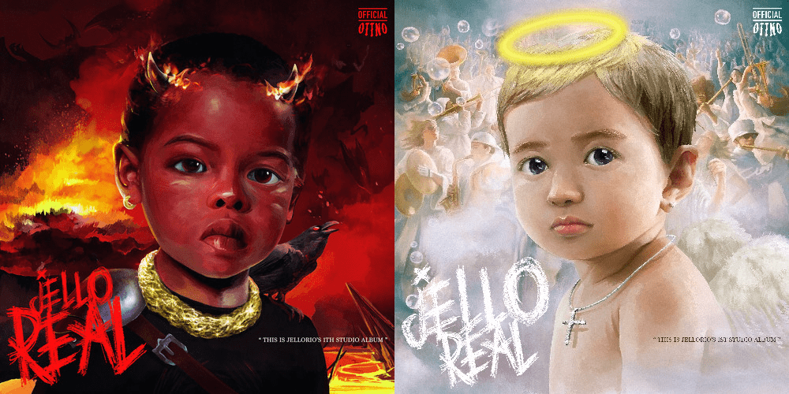

| 歌曲名称 | 备注 |
| --- | --- |
| Intro | 后面参加2020节目里的歌曲《不得扯拐》中用到了这首的副歌 |
| 你不是我 | 回击《Feat.China 联合利华》纪录片后的恶评，有 mv |
| Flex like me |  |
| My Bank |  |
| NO GANG | Feat Tizzy T |
| 花 | 写给去世的亲人，"姥爷，山上的橘子甜吗" |
| 回忆垃圾桶 | 2020节目夺冠演唱的歌曲，节目中有改编 |
| Hair | Feat 雾都 L4WUDU |
| 摇娃娃俱乐部 |  |
| Lighting | Feat 艾热 AIR 又是一首写给各自恋人的情歌 |
| Outro |  |

- 4-7 参与 Asen的首张mixtape《Nesa Tape》合作单曲《Like It》《Once Upon A Time Freestyle》《Know Me》
- 6-22 单曲《月儿圆》，是王以太 remix 版本
- 7-2 单曲《 I 》（歌名是罗马数字1不是I）
- 11-1 和于意 Yee 合作单曲《HIGHWAY》
- 11-12 和罗轩合作单曲《Sunday》，qq音乐可听
- 11-15 和 Asen 的合作单曲《BERRY》，是2020节目里演唱最出圈的一首情歌，当时 Asen 还默默无闻，加上有非常多说唱歌手来 remix，包括 sasloverlord、gali、mac ova seas、李大奔、黄之仪等等，所以很多人都不知道 Asen 是原唱

11月28日，发布首张个人中国风 EP《壹》，收录5首单曲。展现了非常强烈的个人风格和李佳隆对于中国风的独特诠释。（这张EP多首混音来自 Asen）

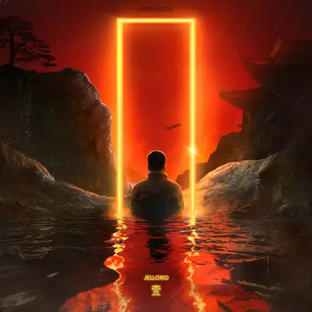

| 歌曲名称 | 备注 |
| --- | --- |
| 一步登天 |  |
| 神笔马隆 |  |
| 我们 | 这首在2020节目里有演唱（以及2020年报名唱的也是这首） （节目报名唱的mv：[BV1qa4y1t74Z](https://www.bilibili.com/video/BV1qa4y1t74Z)） |
| 他们 |  |
| 半山 | 网易云可看 mv |

---

## 2020年

- 2-14 李佳隆做客 TWH 电台(b站有MV：[BV1N7411g7J6](https://www.bilibili.com/video/BV1N7411g7J6))
- 4-18 和 mac ova seas 合作曲《闪电》，当年被称为"auto-tune的最佳使用说明书"，b站有 mv：[BV1v64y127Ew](https://www.bilibili.com/video/BV1v64y127Ew)
- 5-20 和 KANNA BUSH（孟子坤）合作单曲《世界末日》
- 6-19 和 90sBABY 合作单曲《SERPENT》
- 7-27 单曲《还没离开》，网易云可看 mv
- 7-29 和慕斯塔法合作单曲《Falling》
- 8-7 和功夫胖合作单曲《复活》

**参加《中国新说唱2020》节目，获得总冠军**：在节目里加入了加拿大故人"X发电站"战队（mac ova seas 也是同战队的并且是当年的九强），展现了很多对 Auto-tune 的使用，也是大面积承受争议的开始

争议点围绕在：\
1、挂电，电满了，不挂电不会唱。当年大众对挂电的偏见也有加拿大故人的原因，大众普遍认为挂电是要掩盖自己基本功不足或者音准不准等。\
2、新说唱最水冠军，混子。很多观众都认为 GALI 才应该是当年的冠军，但是其实反而两人关系很好，并且经常在歌里面互相 shout out（随着后期同年参加节目的王齐铭和 GALI 的进化，被骂不配拿冠军和新说唱历年最水冠军的说法延续到现在）\
3、只会唱情歌，唱情歌才火的。李佳隆风格很多，各种类型的歌都会唱，情歌不少，但无奈的是火的也都都是旋律情歌。

节目里李佳隆保持对黑粉的回击态度，有一首 diss 键盘侠的歌《听懂没 2.0》（在音乐平台能搜到音源，注意在 b 站和抖音能搜出来的完整纯享舞台现场没给加拿大敌人打码）

推荐观看 b站：[BV1MFdZYsEA4](https://www.bilibili.com/video/BV1MFdZYsEA4) 是李佳隆2020参加节目的冠军历程，一共24分钟（节目歌曲不会在歌手主页，有的歌后面也没出录音室版本，可以冲一下有感兴趣的可以找音源来听，也可以更好体会到争议的来源，这个视频里面因为版权问题会混剪一些别的画面）

| 比赛歌曲 | 链接 |
| --- | --- |
| 海选阿卡贝拉 | [跳1:54](https://www.bilibili.com/video/BV1b8G96vEHM/?t=112) |
| 60s《嗨喽喂》 | [跳0:15](https://www.bilibili.com/video/BV1b8G96vEHM/?p=2&t=14) |
| 双人合作《卫星》 | [跳0:50](https://www.bilibili.com/video/BV1b8G96vEHM/?p=3&t=49) |
| 个人solo《我们》 | [跳0:50](https://www.bilibili.com/video/BV1b8G96vEHM/?p=4&t=49) |
| 战队cypher《SuperX》 | [跳2:26](https://www.bilibili.com/video/BV1b8G96vEHM/?p=5&t=145) |
| 导师帮唱《Juice》（有故人部分） | [跳1:14](https://www.bilibili.com/video/BV1b8G96vEHM/?p=6&t=73) |
| 情歌专场《berry》 | [跳0:40](https://www.bilibili.com/video/BV163V86WE1D/?t=40) |
| 淘汰赛1v1对决李大奔《听懂没2.0》 | [BV1Zs4y1h7qo](https://www.bilibili.com/video/BV1Zs4y1h7qo) |
| 魔王踢馆对战盛宇《不得扯拐》 | [跳3:15](https://www.bilibili.com/video/BV1RCVb6kEbm/?t=194) |
| 导师帮唱《林中游》（和故人合作 | [跳5:03](https://www.bilibili.com/video/BV191Vb63EU7/?t=302) |
| 冠军争夺战对决gali《one love》 | [跳2:55](https://www.bilibili.com/video/BV1g3Vb6vEed/?t=175) |
| 总决赛对决山鸡《回忆垃圾桶》 | [跳1:39](https://www.bilibili.com/video/BV1M5Vb6YEnd/?t=99) [BV1j3KxeJEgL ](https://www.bilibili.com/video/BV1j3KxeJEgL)（备用） |

---

## 2021年

开年参加综艺《天赐的声音第二季》，在节目里和万妮达合作《月亮代表我的心》（老歌改编），和胡夏合作《千言万语》（陶喆专辑曲目）《思念是一种病》（老歌改编）。（两首在网易云部有音源，[BV19X4y1N7JC](https://www.bilibili.com/video/BV19X4y1N7JC)/[BV1yU4y1s7Sg](https://www.bilibili.com/video/BV1yU4y1s7Sg)，可看不看，想看的话有节目 cut，27分钟 b站：[BV1wU4y1W7qL](https://www.bilibili.com/video/BV1wU4y1W7qL)）

在两档节目结束之后，面对巨大的流量，李佳隆又选择了沉淀自己减少曝光，这一年主要是投入到专辑制作之中，也发布了很多单曲

- 1-21 哈弗大狗的推广曲《Big Dog》（QQ音乐可听），b站还有个广告短片：[BV1Nc41167vS](https://www.bilibili.com/video/BV1Nc41167vS)
- 1-30 专辑《传奇》的同名先行曲《传奇》，b站 mv：[BV1wg411m7en](https://www.bilibili.com/video/BV1wg411m7en)
- 4-1 和刘思鉴合作曲《纸上谈兵》
- 4-5 单曲《DICE》，混音和母带来自 Asen，此时 Asen 已离开出人头地（2020年李佳隆夺冠后 asen 离开出人头地）
- 4-27 欧莱雅广告歌《HYDRA POWER》
- 5-27 和 BLOWFEVER 合作单曲《Saucy》
- 6-16 王源合作的歌曲《洄》(b站有MV：[BV1u44y187bD](https://www.bilibili.com/video/BV1u44y187bD))
- 6-19 和布瑞吉合作单曲《全世界流浪》
- 7-2 万妮达 TizzyT 李佳隆联手献礼100周年《百年》（b站MV：[BV1NM4y1M7zR](https://www.bilibili.com/video/BV1NM4y1M7zR) 这首qq音乐有版权）
- 7-15 单曲《偶像系列》，歌名指的是游戏堡垒之夜的一个皮肤系列，网易云可看 mv（字幕 mv可不看）
- 8-14 单曲《抄袭》（这首是情歌，封面的兔子是因为恶恶喜欢兔子），网易云可看 mv
- 9-30 单曲《Room》，情歌爆单（封面插画有恶恶喜欢的迪士尼朱迪兔子的元素）
- 12-24 和 step.jad 依加、刘思鉴合作曲《ok³》

---

## 2022年

离开出人头地回到成都，和女友恶恶以及经纪人 vb 一起成立了 Bornlegend Music 音乐工作室和 BornLegend 的服装品牌。logo：

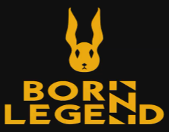

- 1-30 单曲《JELLO FEAT.REAL》，这首歌讲述了自己从上节目爆火后的心境，在迎合市场和自我之间反复拉扯，最后还是选择了离开出人头地组建自己的音乐工作室（后面有发《JELLO FEAT.REAL + 绝》的 mv，可以在听完《绝》后再看）

4月**发布第二张个人 EP《贰》**（QQ音乐试听），收录了三首单曲：《堵》、《U》、《绝》（q音可看 mv）

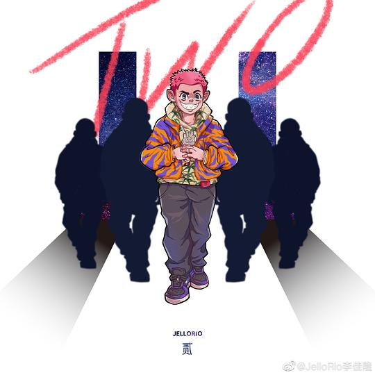这张 EP 算是专辑的开胃菜。

- 5-19 和邓典果 DDG 合作曲《RAVEN》，网易云可看 mv（中国说唱巅峰对决2022节目有这首歌和 PSY.P 的版本《C位渡鸦》，可选择是否观看现场：[BV1s7XkBxExA](https://www.bilibili.com/video/BV1s7XkBxExA)）
- 9-17 和邓典果 DDG 合作曲《懒汉全席》

**同年参加了《中国说唱巅峰对决2022》**，因为觉得自己当下的状态不适合节目竞技节奏，所以在待定之后拒绝万妮达的组队邀请选择离开，但是贡献了很精彩的舞台推荐《传奇》（现场抖音搜），击败 gali 的《亚特兰蒂斯之心》

**9月21日发布专辑《传奇》**，收录9首单曲，由序章、中章、尾章串联起完整的叙事线。专辑灵感来自开放世界游戏，是一次极具个人色彩的"实验之作"，没有邀请任何歌手合作，不刻意迎合市场。李佳隆在采访里说，"我是觉得现在这个阶段应该去承担起做一些不被市场影响，自己想做的东西的责任，这张专辑就是一次尝试。"在制作上，大量融入人声和声到编曲中，还从影视配乐和游戏原声中汲取灵感采样，用音乐搭建世界观的架构。（听之前先看一下专辑详情）

专辑花费了很多心血，李佳隆操刀整专制作，投入了大量的金钱（做说唱赚到的所有钱剩下的全拿来拿专辑了），但评价呈现出明显的两极分化，在当年的热度也很低。

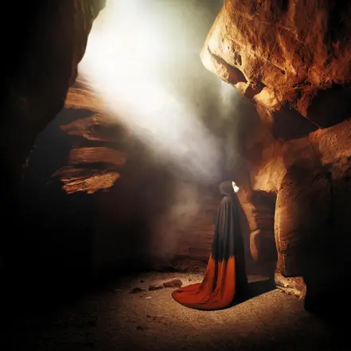

| 歌曲名称 | 备注 |
| --- | --- |
| 序章：降临 TRODUCTION:ARRIVAL (Intro) |  |
| 传奇 Ledgend | 网易云可看 mv，灵感来自游戏《刺客信条：起源》 |
| 黑旗_Black Flag | 致敬游戏《刺客信条4 黑旗》，采样加勒比海盗。有现场可以选择是否观看，b站 [BV19g411m7VL](https://www.bilibili.com/video/BV19g411m7VL) |
| 囚 Cage | 网易云可看 mv，致敬游戏《荒野大镖客》 |
| 月桂 Laurel |  |
| 中章：幻象 MIDDLE CHAPTER:FANTASY (Skit) |  |
| 露西 LUCY |  |
| 盖莎比 A4 GatsbyA4 |  |
| 尾章：重生 EPILOGUE:REBORN (Outro) |  |

《传奇》专辑官方视觉艺术视频（b站，27分钟）：[BV1Pc411q7xu](https://www.bilibili.com/video/BV1Pc411q7xu)

《传奇》专辑电台采访（b站，16分钟）：[BV1eV4y1g7ey](https://www.bilibili.com/video/BV1eV4y1g7ey)

采访提到混音制作人顺德非常合拍，也是从这张专辑之后李佳隆和制作人顺德绑定成长

- 10-13 做客 SoulSense TWH-Frestyle现场表演新作《囚》（b站有mv：[BV14d4y117qg](https://www.bilibili.com/video/BV14d4y117qg)）
- 10-20 李佳隆做客 白板WhiteBoard  | 囚 Cage | 露西 LUCY | DICE（B站有MV：[BV1Wg411a7kM](https://www.bilibili.com/video/BV1Wg411a7kM)）
- 11-5 和 Asen 合作曲《说唱钱》，网易云可看 mv

---

## 2023年

### 单曲

- 1-1 和等一下就回家合作单曲《会不会是月光》
- 4-1 单曲《线》
- 5-13 单曲《小小明星》
- 6-1 单曲《嘉陵》（也有节目版本）
- 7-11 和等一下就回家合作单曲《小的们》
- 7-20 单曲《杜鹃》，有录音室普通/升调/不插电三个版本。网易云可看 mv。这首歌是写给自己的，把自己比作杜鹃鸟。李佳隆："流量和热度可能转瞬即逝，我抓不住它，杜鹃只是一只小小鸟，它可能没有办法飞得很高，但是当它用尽力气冲破云层缺氧坠下之前留下的最后一鸣你一定会记住"。（仔细听歌词有倒叙）
- 9-14 和黄旭合作单曲《WHO'S NEXT》，网易云可看 mv

**参加节目《中国说唱巅峰对决2023》**，和战队"小跑猪"走到最后一轮，成为这一年节目里个人 PK 战绩最佳选手。下面是节目歌曲（在网易云也都有音源可以直接搜）：

| 歌曲名称 | 备注 |
| --- | --- |
| 嘉陵 | Solo 歌曲，有录音室版本，现场有改编，推荐观看 b站：[BV1aG8NeNEww](https://www.bilibili.com/video/BV1aG8NeNEww) |
| Hard to believe | 和佐加的合作曲，现场可看不看 |
| Be Alright（心跳节拍） | 战队合作曲，可听可不听 |
| 在 Cypher 里 | 战队 cypher，可听可不听 |
| 续写传奇 | Solo 歌曲，**一首回击质疑的歌**，非常推荐观看现场，抖音搜 |
| 小跑猪的新衣 | 战队 cypher，改编 vava《我的新衣》，可看不看 |
| 小小明星 | Solo 歌曲，有录音室版本，现场发挥也不错。但是这首挂电的歌因为在"回到街头"主题环节演唱击败黄旭被喷"不够街头"不该赢 b站：[BV17Z421p7mb](https://www.bilibili.com/video/BV17Z421p7mb)（视频画面比较小） |
| 偶像系列 | Solo 歌曲，有录音室版本，现场可看不看。 |
| 线（remix） | 合作曲，录音室版本是李佳隆自己的情歌爆单《线》。和黄旭的合作可听可不听 |
| 杜鹃 | Solo 歌曲，有录音室普通/升调/不插电三个版本。现场可看不看。 |
| 猪队友 | 战队合作曲，可看不看 |

这一年参加节目依旧争议很大，核心还是2020时期争议的那几点（挂电、情歌、混子、最水冠军），与此同时在唱不挂电歌曲时也有人说"还是挂电好听应该挂电"。这个阶段也有"混的最差的冠军"的声音（这几年的音乐选择实际上真的影响到了李佳隆在大众层面的热度，在商业层面落后那几年节目其他冠军和热门选手的发展。25年还有过巡演门票没卖完的情况。）

---

## 2024年

- 4-3 和 JACKWAVY 合作单曲《新世界》

4月12日**发布个人 EP《叁》**，收录3首单曲，同样是专辑预热 EP。

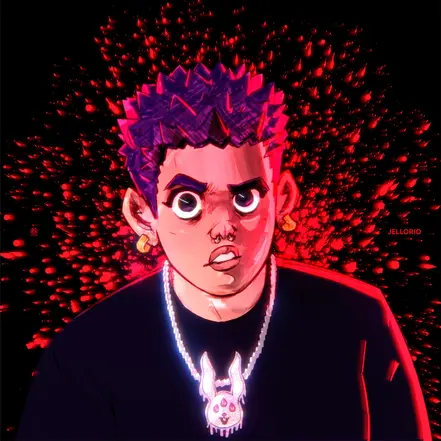

| 歌曲名称 | 备注 |
| --- | --- |
| 都要耍哈 | 推荐观看 b站live：[BV1XM4m1R717](https://www.bilibili.com/video/BV1XM4m1R717) |
| 咋说 | 2024年作为大魔王在2024中国新说唱唱了这首歌，李佳隆自己抖音主页有发舞台（2024.6.30日发布） |
| OMG | 出人头地演唱会开头曲，童声合唱非常震撼，现场是升调版本，一首适合在节目的大舞台上表演的歌，推荐观看演唱会版本： [5n5DF9y](https://b23.tv/5n5DF9y) |

- 5-13 和 DRODUMANA 合作单曲《枕边事》，写给妈妈的歌
- 6-30 和等一下回家合作单曲《Ocean》
- 7-13 和 NIAN424 合作单曲《小马》
- 7-26 单曲《蛙》，写给去世外婆的歌曲
- 8-10 乐堡啤酒广告曲《LOVE SONG》

8月16日**发布专辑《GUOXIA》**，收录11首单曲。这是一张风格全面的 all feat 专辑，合作 rapper 有 KILLY、Asen、刀脚、DDG、Capper、GALI、mac ova seas、JinJiBeWater 隼等，专辑详情十分真诚地写下每个合作歌手的故事和歌曲背景（必看）。

- 专辑名字《GUOXIA》是过下，四川方言，GUO 指用什么什么方式，比如"我吃饺子过吞"、"我喝酒过抿"；XIA 是动词，使用在任何流体动势很大的情况下，比如"这个血滴得太多了像在下一样"。放在这张专辑里的特定含义就是：血出得多且猛。

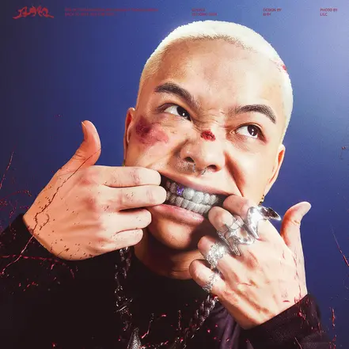

| 歌曲名称 | 备注 |
| --- | --- |
| Safe Landing 安全着陆 | Feat KILLY (b站有MV：[BV1KU411S7HF](https://www.bilibili.com/video/BV1KU411S7HF)）（补充一个知识这首歌的MV是李佳隆北美巡演的时候在加拿大多伦多拍摄的可以看到MV量有 CN TOWER 是多伦家著名地标）网易云可看 mv |
| GUOXIA | Feat Asen (b站有mv：[BV1N4YqedEXG](https://www.bilibili.com/video/BV1N4YqedEXG)（有现场但是改词特别厉害不推荐看）（补充一下巡演深圳站唱了8遍hhh）live house地震曲，这首歌获得了drake 制作人boi1da的赞，他也是boi1da唯一关注的中国说唱歌手）网易云可看 mv |
| 闪客快打 | Feat 刀脚 闪客快打是4399经典暴力游戏 |
| Keep it low | Feat 张颜齐（张颜齐之前是 battle mc，后参加男团选秀出道，这首歌唱完之后可以看一下评论区） |
| 往上走 | Feat 邓典果 DDG |
| 天上有 | Feat Capper |
| 白色月季 | Feat 等一下就回家 |
| 无法拯救 | Feat GALI |
| Different | Feat KnowKnow |
| Myself | Feat mac ova seas |
| 功成名就后 | Feat JinJiBeWater 隼 |

这张专辑在李佳隆自己的抖音有发布三组相关的视觉艺术照片，推荐看一下，这组照片和大众对李佳隆可爱的印象形成极大反差。（在抖音他自己的主页日期筛选2024年7月和8月就可以看到，图文）

《GUOXIA》专辑电台采访（b站，时间比较长1小时10分钟，可选择是否观看）：[BV187H9e2EhQ](https://www.bilibili.com/video/BV187H9e2EhQ)

《闪客快打》《Safe Landing 安全着陆》《往上走》有电台 live b站：[BV1Tr421N7LH](https://www.bilibili.com/video/BV1Tr421N7LH)

- 8-26 和 HEAT J 合作单曲《B DAY》
- 8-29 单曲《奇怪》
- 9-13 和 KANNA BUSH 合作单曲《SPECIAL（特别）》
- 10-20 做客离岛LIVE（B站MV：[BV1N4CZYXEL9](https://www.bilibili.com/video/BV1N4CZYXEL9)）
- 12-6 和 SHIGGA SHAY 西阁 合作单曲《Shawty 晓得下》
- 12-17 和 step.jad 依加 合作单曲《赶路的蝴蝶》
- 12-24 和刘聪合作单曲《散心》

---

## 2025年

- 1-1 和 NIAN424 合作单曲《陈刀仔》

**2月14日，没有预热发布《出人头地 2025 Dreams Come True Mixtape》**，收录12首单曲。涵盖多种风格，展示了李佳隆在音乐制作和旋律创作上的高水准。专辑名称致敬他曾经在厦门加入的出人头地厂牌。这张专辑不仅是对过去音乐的总结，也是新起点的开始，并预告了3月1日广州第一场个人演唱会。这张专辑获得了网易云 2025最佳流行说唱专辑奖。

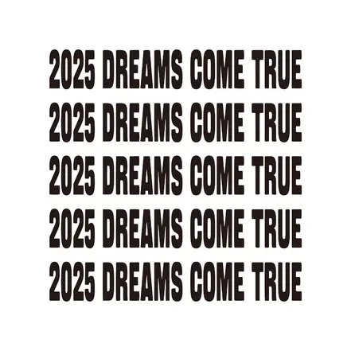

| 歌曲名称 | 备注 |
| --- | --- |
| 出人头地 |  |
| 老花园 | 老花园指的是李佳隆的家乡蓬安县的五星花园 |
| 路灯 | 1月24日（小年）发布，后收录进专辑。有社区 live 版，b站 [BV1xheyzzEYu](https://www.bilibili.com/video/BV1xheyzzEYu) |
| 加速 Freestyle |  |
| 谢谢你 |  |
| 没对 |  |
| Top Talk | Feat Melo |
| 我不是说唱歌手 |  |
| 爱在出租屋 | 想到在这张专辑预热的第一场个人演唱会里向恶恶求婚再听这首歌真的很感动（夹带私货中...） |
| 爱错了？ |  |
| MTL | Feat Lil Asian |
| Back On Trap |  |

《出人头地 2025 Dreams Come True Mixtape》专辑电台采访（b站，11分钟）：[BV1qfX5Y5EXY](https://www.bilibili.com/video/BV1qfX5Y5EXY)

- 3-1 李佳隆在广州亚运城综合体育馆举办“出人头地”演唱会，成为中国第一个将弦乐团搬上现场舞台的说唱歌手 嘉宾 ASEN、王以太（b站有现场视频：BV1bk9fYoE5w 推荐开场OMG、林中游（和加拿大故人在2020年节目里合作的歌曲也是时隔很多年在节目外演唱，也有和ASEN合体版的GUOXIA和说唱钱）

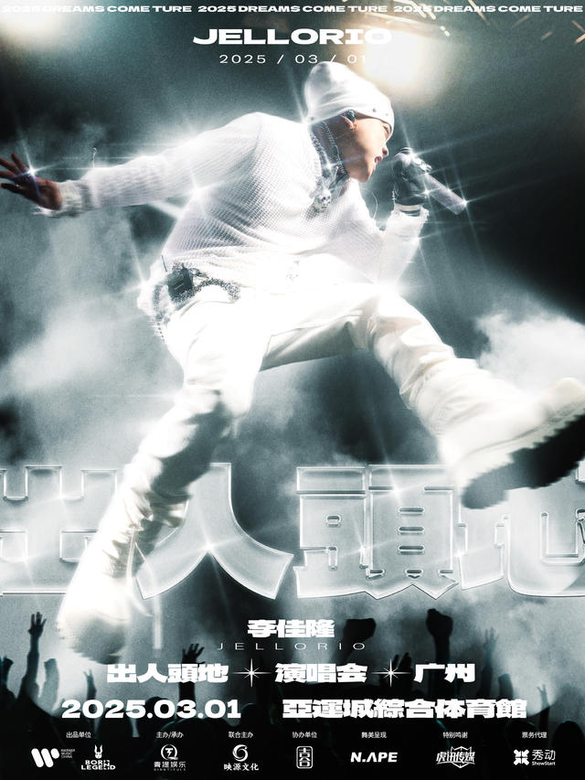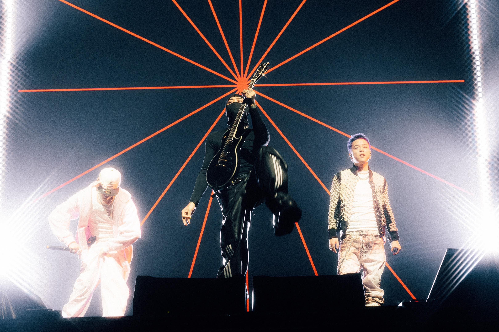

- 3-4 做SoulSense TWH Freestyle 演唱《加速 Freestyle》(b站有：[BV18r9iYFEEK](https://www.bilibili.com/video/BV18r9iYFEEK)）
- 3-7 做客SoulSense TWH LIVE 演唱《我不是说唱歌手》《Top Talk》（b站有：[BV1pGRMYuEKa](https://www.bilibili.com/video/BV1pGRMYuEKa)）
- 3-15 和 Malkon Flocka Flame 合作单曲《Dirty（脏点）》
- 3-25 和 CashTrippy 合作单曲《FLY SHXT ONLY》
- 4-11 单曲《路下辙》
- 5-18 和黄旭合作单曲《FLOW FLOW》
- 6-1 收录在制作人 TQ 专辑，单曲《电话粥》
- 6-7 和 UDIGG 合作单曲《大师的心》
- 7-17 单曲《满了》为节目写的歌，讽刺 hater 说他"电满了"。现在巡演经常《GUOXIA》接《满了》连唱好几首，感兴趣可以搜一下巡演现场看，MV：[BV1VnHszaEXD](https://www.bilibili.com/video/BV1VnHszaEXD)（这个是李佳隆创立厂牌以后的SAGGING巡演视频）
- 7-23 收录在制作人 G23 专辑，单曲《说唱》
- 7-30 和 Rich4ever 合作单曲《Get Rich（顾从前）》，(b站有mv [BV1xN8AzrEsA](https://www.bilibili.com/video/BV1xN8AzrEsA))
- 8-13 和张子墨 z!moo（男 idol）合作单曲《TEACH ME HOW TO LOVE》

上半年作为"大魔王"和助唱嘉宾（以及帮黄子韬编曲制作）参加节目《中国新说唱2025》，被选称为"最强大魔王"。（节目里面除了助唱其他唱的都是发布过录音室版本的歌曲，在节目里会改词，现场可看不看吧）

但这段时间里争议依旧，并且因为节目里《满了》《GUOXIA》这类选曲、一直以来歌里面对行业和 hater 的态度以及10月 beef 里下场挺 Asen 发布的 diss 被攻击"审美霸凌听众""走不起来骂观众"。（如果有打算了解 beef 可以等下一个开荒 Asen 的时候再一起听，涉及编外人员河南说唱之神）挂电、情歌、最水冠军这几点也被再次拿出来，"最火的歌还是靠艾热"\
不过在同圈圈内李佳隆口碑很高，是公认的国内 Auto-tune 天花板和六边形战士。

**8月30日，李佳隆个人厂牌 Born Legend 发布首专《SAGGING》**，收录9首单曲。专辑以 Trap 风格为主，也是厂牌新人的首次亮相，其中李佳隆只参与了三首歌曲的演唱（表格标黄），更多的是参与到专辑整体的制作和风格把控上，等一下就回家也在这张专辑里展现了编曲制作的能力。

- Born Legend，译为生来传奇，花名兔厂/Bunny，厂牌 logo 三兔共耳，在佛教里意为前生、今生、来世，有因果观和轮回观的含义。厂牌成员：李佳隆、等一下就回家（真名叶宇桢，小名天天/小天）、Sillygami、ZenithLuvYou、陈俊岐、Yoanko Futura（小名安安）。其中除了等一下就回家，剩下基本是新人出道。

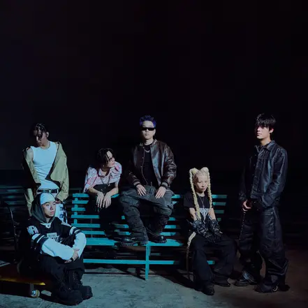

| 歌曲名称 | 备注 |
| --- | --- |
| WLG（Whole Lotta Guap） | 厂牌 cypher，全员演唱，网易云可看 mv |
| 耍到顶 | 等一下就回家/陈俊岐/ZenithLuvYou |
| Ten Toes | Sillygami/李佳隆，有社区 live 版，b站：[BV1r2eCzwEBz](https://www.bilibili.com/video/BV1r2eCzwEBz) |
| 天才的汗水 | Yoanko Futura/陈俊岐/Sillygami/ZenithLuvYou |
| AWAY/离开 | 陈俊岐/李佳隆 |
| Eeny Meeny Money Bunny | 陈俊岐/Yoanko Futura/ZenithLuvYou/Sillygami |
| 路太长 | ZenithLuvYou/Sillygami/陈俊岐 |
| 落雨 | 等一下就回家/ZenithLuvYou/Sillygami |
| 4K | Yoanko Futura |

- 2-12 推荐观看 views 纪录片《李佳隆&BornLegend：如何成为传奇？》（B站：[BV1LtcYzTEMC](https://www.bilibili.com/video/BV1LtcYzTEMC)）
- 12-9 和 capper 合作单曲《兇狠類型:RoughTypeShxt》，(B站MV：[BV1YeBLBfEk8](https://www.bilibili.com/video/BV1YeBLBfEk8))
- 12-21 参与艾热专辑《艾·思集》和艾热、王以太合作《天下无敌！》

---

## 2026年

- 1-10 参与于意yee专辑合作曲《枪火》（网易云无版权，QQ音乐可听）
- 1-16 和 KITO 合作单曲《TOX2C》
- 3-10 和等一下就回家合作单曲《不是格列佛》
- 3-25 和 Fendighee Ricch 合作单曲《水上漂》

今年即将发布全流行 EP

李佳隆已经做好了三张专辑，并在今年发布流行专辑，后需两张专辑也会陆续发布，作为靠星球坠落走红在当时被称为情歌小王子的李佳隆走起后没有依靠更容易传唱的旋律歌曲维持热度赚更多的钱，他选择与流量保持距离，沉淀做出一张张优质专辑来打好自己的的口碑，或许他做些符合市场的歌曲会有更大热度但李佳隆就是一个对待音乐自我且真诚的人。

文稿撰写主笔：@苹果气泡美式

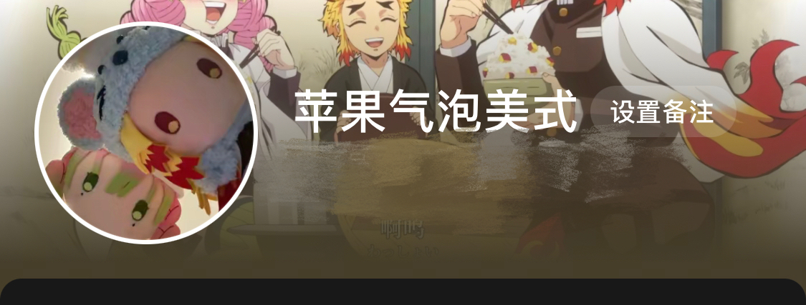文稿撰写修改：

抖子粉丝：果冻鸡尾酒、髙伊點、加拿大奔跑少年

非常感谢以上粉丝朋友的付出！