# 人物开荒：

连麻Swimmings
人物志音乐目录文稿

---

## 童年

**连麻 Swimming**，本名孙一民，和双胞胎弟弟隼 Jinjibewater（本名孙一进）于 1996 年 12 月 14 日出生于四川成都，前后相差 1 分钟。连麻取自 "连续麻痹自己"，Swimming 是孙一民的谐音。

幼时家境不错，后因家里破产，五年级时父母离异等原因，双胞胎兄弟有 5 年左右的时间没有生活在一起。隼跟着妈妈去了重庆，连麻则辗转多地，先是和爷爷奶奶在广安生活，14 岁辍学后随着爸爸做生意去了北方，直到高中才回到成都读书。哥俩最早在学校社团打 b-box，进而喜欢上 hip-hop 和说唱。通过 C-block、CDC 说唱会馆等等了解中文唱。

> 注：一张可能要问两位的妈妈才能分清是谁的照片

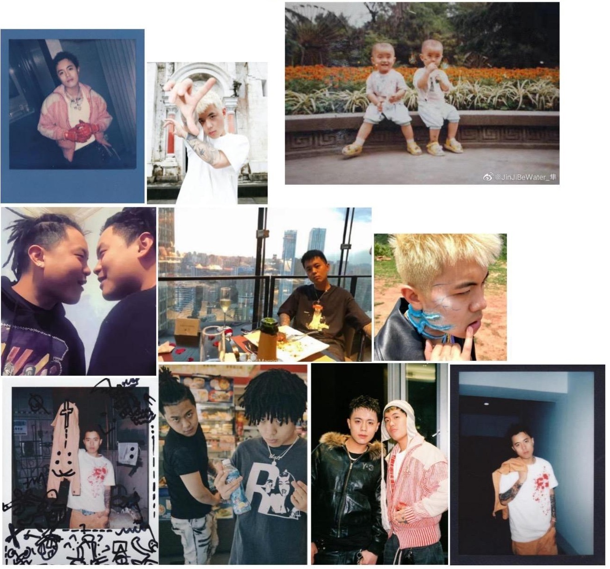

---

## 2013 年

连麻早年间做过很多 工种，纹身师、电话销售、火锅店服务员等等。

注：连麻和隼都做过纹身师。连麻主攻 Chicano 风格，给 rapper Sasi、KenRobb、kkluv 纹过身。隼给连麻在腿上纹了《毛骗》网剧最后一句话 "万法皆空，因果不空"。

酷我音乐上有一首发布时间未知的 B-box demo 《hero's come back(demo)》 注：网易云以外的版权会单独标注，未标注则在网易云收听。
音源链接：[https://www.kuwo.cn/play_detail/257355182](https://www.kuwo.cn/play_detail/257355182)

2013年左右,连麻第一个加入的是一个重庆本土说唱团体叫重庆扯客（CQC Check），团队受到当时叫 Young Money 的 Gibb-Z 黄泽的演出邀请，两个人很聊得来，还发现生日是在同一天，于是决定一起做音乐。离开重庆扯客后，连麻加入了说唱团体 ANT，当时的团队成员是：连麻、Young Money、阿晴 T-mystic（现在是火锅店的老板的、泡菜。也就是下水道蚂蚁的由来。同年 ANT 和另一个(成都)的说唱团体 TGK 发生了 beef，连麻并没有参战，之后双方就和解了，还办了联合专场演出《化敌为友》。

2013年连麻随团队 ANT 发布单曲《成都超姐》，无音源，B站可看 MV：[BV1PxYpz6EsX](https://www.bilibili.com/video/BV1PxYpz6EsX)

> 注："超哥""超姐"是四川方言的俚语，指在社会上帮街混派、讲排场、行为前卫甚至略带"混社会"色彩的年轻人。"超社会"，即不务正业、游荡街头、后来演变出中性含义，指穿着时髦、行为前卫、有个性的人，在部分语境下，也可作为对某人 "很牛""很厉害" 的称谓。

---

2013 年 11 月 3 日还叫 R.Z 言味的隼 ft. 连麻发布 diss track《老子给你开路》，diss 重庆 rapper 门徒。土豆网链接已失效。百度贴吧评论里的歌词附在下页。\
注：curse words 太多，注意避让。

贴吧链接：[https://tieba.baidu.com/p/2684369463?fr=undefined](https://tieba.baidu.com/p/2684369463?fr=undefined)

```plaintext
土货毁了重庆市场你们精神已经失常
开口闭口叫着这个才是纯正的underground
说唱中的舔批匠射的全是米汤
每当圆月之夜你婆娘又开始潮慌 曝光 吃点老子窝的糟糠 诈尸嘉陵江 奔丧的时候帮你补个妆
最后晓不晓得老子们说唱士气高涨 浪 麻烦关掉音响卸下伪装
唱 求莫实力求莫势利你们只是一群人力
说唱开始告急和你爸切搞基
手上纹点纹身就开始冒充花臂 RAPPER好多DISS你都形成一种乐趣
脑壳受了刺激哇那搞快去看中医
天到黑都在PEACE小心遭累劈死
重庆这个圈子已经完全把你抵制
在报出你的地址 挨上我的耳屎
神起这首DISS FUCK 弹崩子的勾子
周博通传我一身神通喊我关门打狗
锤子大爷说唱歌手先把话ter称抖
周博通传我一身神通喊我关门打狗
日了你的HOMI再燥翻你的好友
你的FLOW再抛锚拿出来秀哈撒
你那些翻唱的歌曲都拿起来溜哈撒
放哈撒
哥子这叫说唱合唱在楼上
BITCH全部SHUTDOWN 遮了你们的光亮 拿着钢叉 随时爆你的菊花
嘴巴不要打妥嘛脚杆不要打滑
七七四十九押把你从祖籍头抹杀
过年还要遭挨打的废头子娃娃
CQC头的败类不要继续犯罪
郊县Rapking吃瓢儿白还说太贵
你的flow在抛锚拿出来秀哈撒
你那些翻唱的歌曲都拿起来溜哈撒 放哈撒
全家都信耶稣才生出你个野猪
你爸是黑崎一护你妈逼就叫万年封住
金子山去入住 跪倒慢慢领悟 继续你的说唱之路 老子给你开路
说唱灌输我的细胞
老子从GOSH哪儿拿了把电刀
我们打架不用坨子都用电拷
门徒你们屋头开的都是超跑
奇葩打完手冲还要写首歌来歌颂
身体还是要珍重不然包皮又开始疼痛
你在路边捡点树叶抽就说飚了飚了
今天又花了二白五垭口切消磨
找了个70老太婆谈心缓解寂寞
3秒钟就和太婆两个身体互相融合
只稳妥 事后还要互粉微博
太婆说以后潮慌了记到过来点我
周博通传我一身神通喊我关门打狗
锤子大爷说唱歌手先把话ter称抖
周博通传我一身神通喊我关门打狗
日了你的HOMI再燥翻你的好友I
```

---

## 2014 年

2014 年，考入电子科技大学成都学院，连麻在蜀兴职业中学读中专，阿清和黄泽则带着 ANT 的名号去了重庆发展一段时间，还闯进了《中国好歌曲》重庆地区海选赛的决赛。连麻和隼都想在成都发展说唱事业，于是二人一起加入了已经改名为 Brand New Muzik 的 TGK，也就是这时认识了团队里还叫做 Core（中途用过一段时间 Cico 做 AKA）的 Sasi。三人成为了一段时间的队友，但仅是认识。很巧的是，Sasi 还是隼同校的学长，后面慢慢玩在一起。

注：Sasi 原名孙敏捷，网友戏称三孙为：孙敏捷、孙力量、孙智慧

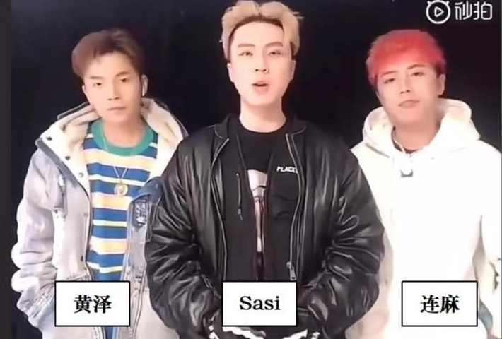

不久后 T-Mystic 阿清（后改名为 T-Clear）和改名为 Gibb-Z 的黄泽回到了成都，连麻和隼也退出了 Brand New Muzik，组了一个二人组 Twins King。四个人将 ANT 升级为了 RHBE 厂牌。这四个人也就是歌词里住在八平房字里的四个小子。

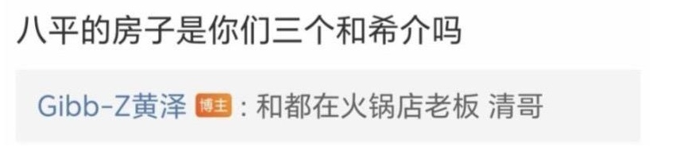

2014 年 8 月 14 日连麻 言味 T-Mystic Gibb-Z 发布单曲《在路上》，土豆网链接已失效，豆瓣小站无法播放。

贴吧链接：
[https://tieba.baidu.com/p/3229122501?fr=undefined](https://tieba.baidu.com/p/3229122501?fr=undefined)
[https://tieba.baidu.com/p/3237999759?fr=undefined](https://tieba.baidu.com/p/3237999759?fr=undefined) 内有 MV 截图

下页附上百度贴吧里的歌词。

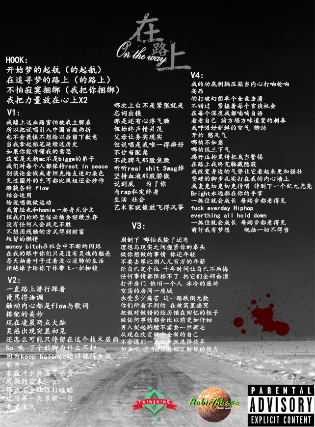

---

2014 年 11 月 5 日 Twins King 发布单曲《Both King》，无音源，收录于厂牌混音带《RHBE Mixtape》。注：微博贴出的歌词图片已被和谐。

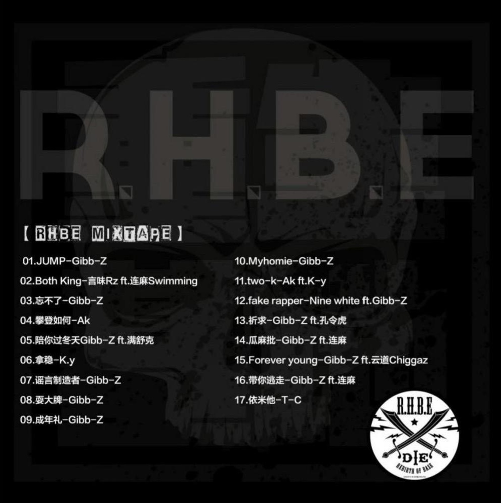

> 注：第 14、16 首是连麻的 featuring

2014 年 12 月 31 日 RHBE 发布厂牌 2015 Cypher，无音源，B 站可看 MV：[BV1SZ421N7Qr](https://www.bilibili.com/video/BV1SZ421N7Qr)

---

## 2015 年

2015 年 4 月 17 日连麻 RB Gibb-Z 发布单曲《麻烦家》，酷狗音乐可听。

2015 年 7 月 16 日发布个人单曲《家长会》，QQ 音乐、酷狗音乐可听。

2015 年 8 月 12 日 Twins King 发布单曲《回头无岸》，酷狗音乐可听。

2015 年 10 月，RHBE 厂牌，成都音乐厂牌 StreetSoul、贵州音乐厂牌 Shinning Life 合并成为说唱厂牌 UP Gang 上都音乐。

2015 年 12 月 13 日 UP Gang 发布厂牌 Cypher 《Cypher mix》，酷狗音乐可听。2:07 是隼，2:46 是连麻。*注：猜的*。

## 2016 年

2016 年 2 月 26 日发布单曲《嘿 哥们儿》，酷狗音乐可听。

2016 年 6 月 17 日发布单曲《自然》，酷狗音乐可听。0:53 是连麻，2:26 是隼。
*注：猜的*。

2016 年 7 月 24 日 Twins King 发布组合 Mixtape《纯真赤子》，酷狗音乐音源仅剩一首隼的个人单曲《纯真》。

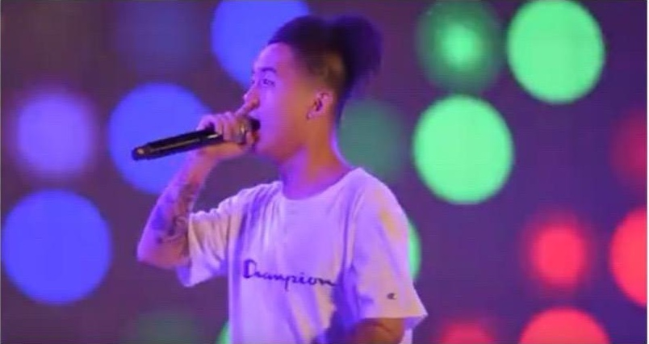

---

## 2017 年

2017 年连麻和言味发布单曲《HOT POT》，无音源，B 站可看 MV：[BV1KgEUz1Em3](https://www.bilibili.com/video/BV1KgEUz1Em3) 注：画质很差。

2017 年连麻拍摄了个人纪录片， B 站可看：[BV16C4y1t756](https://www.bilibili.com/video/BV16C4y1t756) 注：时长 4 分 23 秒。

2017 年 8 月 5 日连麻发布首张个人 Mixtape《Wake Up》。

| 序号 | 歌名 | 备注 |
| --- | --- | --- |
| 1 | CD City | 酷狗音乐可听 |
| 2 | Wake Up | ft. R.Z 言味 |
| 3 | Trouble | ft. ICE 杨长青，酷狗音乐可听 |
| 4 | 我出剪刀你出布 | ft. Sasi & ICE 杨长青，酷狗音乐可听 |
| 5 | Sorry (mix by LimBo 林) | ft. ICE 杨长青 |


注：2017年左右，Core、ICE、Gibb-Z 三人组成组合亚洲捆绑 Asian SM，隶属于 UP Gang。随后三人一起参加《中国有嘻哈》。Core 和 Gibb-Z 没能获得链子，ICE 获得了链子却因发放链子过多而被收回。于是三人发布 diss track 《中国有嘻哈 diss》。被车澈称为那群众多对节目的 diss track 里唯唯二被记住的 diss，另一首则出自 Gali 之手。之后三人的组合也因此被声闻聚禁 Seven Gurus 厂牌签下。后 Core 改名为 Sasike，也就是我们熟知的 Sasi。

同年，隼因种种原因放弃了一段时间的说唱，选择南下福建进修美术做纹身师。

---

## 2018 年

2018 年连麻与声闻聚将 Seven Gurus 厂牌签约。

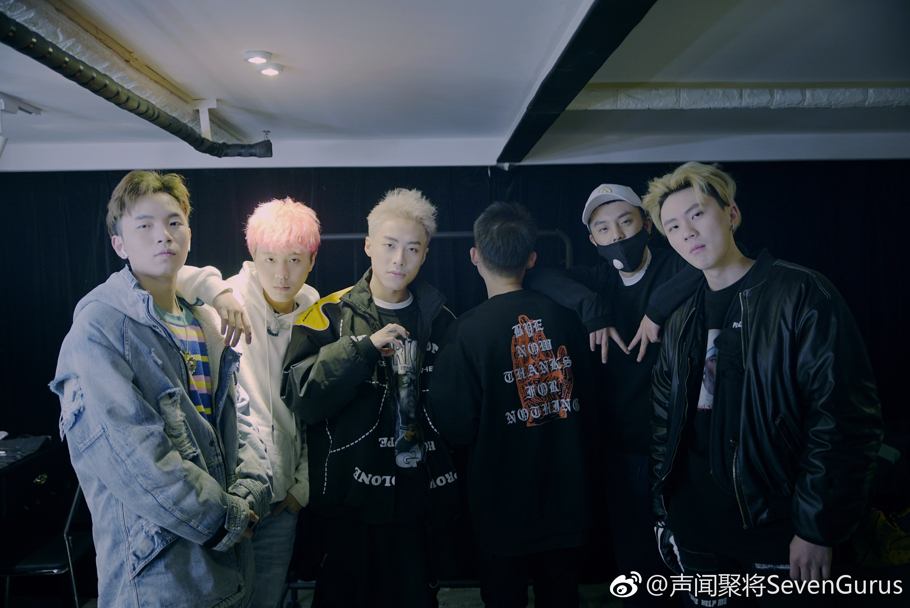

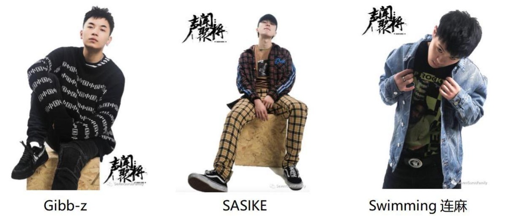

2018 年 1 月 20 日连麻和 Sasi 发布单曲《晚风里》注：网易云搜索SevenGurusFamily。

2018 年 2 月 5 日，连麻 ICE Sasike Gibb-Z Yiwei.Sun（言味的新 AKA）发布厂牌 Mixtape《Freestyle Challenge Show》

> 注：隼并没有和声闻聚将签约，这段时间和说唱保持着若即若离的关系。

其中连麻演唱的歌曲为《没感觉》，无音源， B 站可看 MV：[BV1LU4y1a7Fq](https://www.bilibili.com/video/BV1LU4y1a7Fq)

2018 年 4 月 16 日连麻发布个人单曲《垃圾袋》
2018 年 4 月 20 日连麻和 Sasi 发布单曲《偷心》

同年，连麻和 Sasi 组成组合 OVERLXRD，开启高产模式，一年连发了 3 张混音带。并于 4 月 27 日发布组合第一张同名 Mixtape 《OVERLXRD》，全网网易云音源不全 ，b站可听 ：[BV1PJf4BhEwU](https://www.bilibili.com/video/BV1PJf4BhEwU)

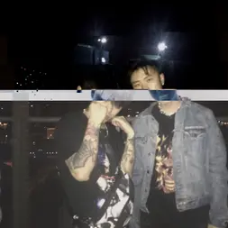

> 注：OVERLXRD 这个名字来源于动漫《OVERLORD》。Sasi 想将自己比作故事中的主角，冷酷、强大，还拥有着忠诚的守护者。此后 Sasioverlxd 全名出现。

| 序号 | 歌名 | 备注 |
| --- | --- | --- |
| 1 | INTRO |  |
| 2 | whole lot a gang sh!(BY:TREETIME) |  |
| 3 | 变很大 (BY:TREETIME) |  |
| 4 | 垃圾袋(BY:Skei) |  |
| 5 | 飘(BY:TREETIME) |  |
| 6 | 不笑子 (BY:TREETIME) |  |
| 7 | 要求多要求高(BY:TREETIME) |  |

注：Jinjibewater 的 AKA 在此 Mixtape 中第一次出现，Jinji 来自《道德经》中的第三十三章：尽己。Bewater 则是出自李小龙的著名言论 "Be water, my friend."

2018 年 7 月 19 日，组合 OVERLXRD 发布组合第二张同名 Mixtape《 OVERLXRD!!》，全专网易云云音源 不全 ， b站可听 ：[BV131A9zAEZ4](https://www.bilibili.com/video/BV131A9zAEZ4)

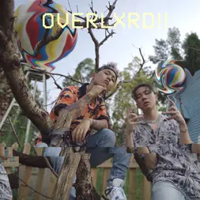

| 序号 | 歌名 | 备注 |
| --- | --- | --- |
| 1 | intro |  |
| 2 | 你是我 | B 站可看 MV： |
| 3 | ABC (prod:DP) |  |
| 4 | 满满 | B 站可看 MV： |
| 5 | 恐惧 |  |
| 6 | Green Ninja |  |
| 7 | 暴力书包 |  |
| 8 | 匕首 (prod:HHH) |  |
| 9 | 衣架 (prod:AITIO) | B 站可看 MV： |
| 10 | 9 (prod:HARUHI) |  |
| 11 | 青春期的我 |  |
| 12 | DUDUDU 君という花 cover | 直译为以你为名的花，原曲是日本摇滚乐队 ASIAN KUNG-FU GENERATION 的代表作，因作为动画《火影忍者》片尾曲被大众熟知。 |
| 13 | SSS (prod:HIGH) |  |

2018 年 8 月 4 日 Gibb-Z 发布个人 Mixtape《糖果星球》，连麻在《无可奉告》中 featuring，B站可看 MV：[BV1L64y1x7gU](https://www.bilibili.com/video/BV1L64y1x7gU)

2018 年 8 月 14 日连麻和韩国歌手 YOONNO 发布单曲《拒绝》

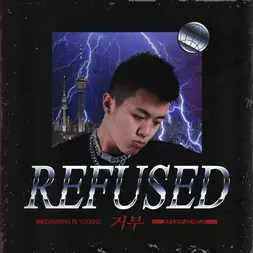注：在连麻网易云个人主页

2018 年 8 月 21 日连麻发布个人单曲《CHEF》，无音源， B站可看MV：[BV19o4y1D7UD](https://www.bilibili.com/video/BV19o4y1D7UD)

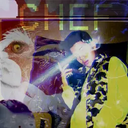

2018 年 9 月 27 日连麻发布个人单曲《为什么押韵》，酷狗音乐可听。

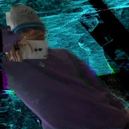

2018 年 11 月 21 日连麻 Sasi Gibb-Z 发布单曲《圈套》，QQ 音乐可听。

2018 年 12 月 30 日，组合 OVERLXRD 发布组合第三张同名 Mixtape《OVERLXRD III》，全专网易云音源不全，b站可听：[BV1f5wNzNEYw](https://www.bilibili.com/video/BV1f5wNzNEYw/)

| 序号 | 歌名 | 备注 |
| --- | --- | --- |
| 1 | intro |  |
| 2 | One (by. B Young) |  |
| 3 | take shower ft.2kc_AAA Lil |  |
| 4 | bad feeling (by. Thaibeat) |  |
| 5 | 223 (by. Penacho) |  |
| 6 | Dark (by. Penacho) |  |
| 7 | GAJA (by. Asian man) |  |
| 8 | swim swim (by. $iren) |  |
| 9 | 弹珠口袋(by.Haruhi) |  |
| 10 | I Forgot (Let Me In remix) |  |
| 11 | Trap Kid (by.Valee) |  |
| 12 | Ghost Cypher ft.2kcAAA |  |

---

## 2019 年

2019 年 1 月 18 日连麻发布个人单曲《咩咩蚊》

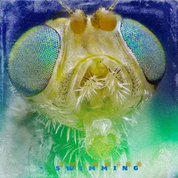2019 年 2 月 14 日连麻发布个人单曲《HOE》，酷狗音乐可听

2019 年 3 月 4 日连麻发布个人单曲《Hormone》

2019 年 5 月 10 日连麻发布个人第二张 Mixtape 《YELLER》

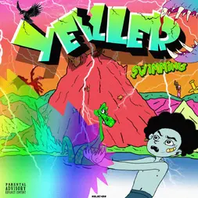

| 序号 | 歌名 | 备注 |
| --- | --- | --- |
| 1 | GO RAP(intro) |  |
| 2 | DRAMA(by.eskry) |  |
| 3 | 你梦见我不告诉我 |  |
| 4 | 160块(kevin) | B 站可听： |
| 5 | 龘(by: Deadeyes) |  |
| 6 | MOVE(by: cxdy) |  |
| 7 | 南柯一梦 | 无音源 |
| 8 | 丢人 |  |
| 9 | the end(by YZ) |  |

2019 年 6 月 3 日连麻 Sasi 2KC_AAA 发布单曲《DAWG》，无音源。

2019 年 7 月 17 日连麻 dhshsj 发布单曲《拗卵》。

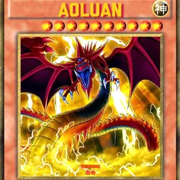注："拗 ao 卵"是四川方言中的一个俚语表达，常与"犟"连用为"拗犟卵"，用于形容性格极其固执、油盐不进、喜欢抬杠、认死理的人。

2019 年 7 月 31 日连麻发布个人单曲《咋的哦》

2019 年 8 月 9 日连麻 Doooboi ANT1- BOI 发布单曲《玩火》，QQ 音乐可听。

2019 年 9 月 16 日连麻发布个人单曲《BINGO》

2019 年 9 月 19 日连麻 Tony KillaR 发布单曲《Famous》

2019 年 11 月 21 日连麻发布个人单曲《瘾疙瘩宝》

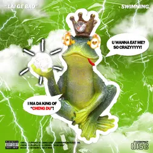
注：四川话蛤蟆的意思。在这首歌中，连麻开始尝试将旋律融入腔调，因此这首歌也被视为连麻的风格转变之作。

2019 年 12 月 14 日连麻 Sasi 发布单曲《pussy out my room》
2019 年 12 月 28 日连麻 刘明宇 Lil-7 发布单曲《90S LOVE U》

2019年左右， Sasi 通过理发店老板的朋友圈认识到了来自甘肃甘南的藏族组合 RICHNOMADIC（意为富有的游牧民族），三人先是取得了联系，进行了线上合作，2020 年 Bako 和榨菜两人来到成都做说唱。至此五人组五名成员全部出现。

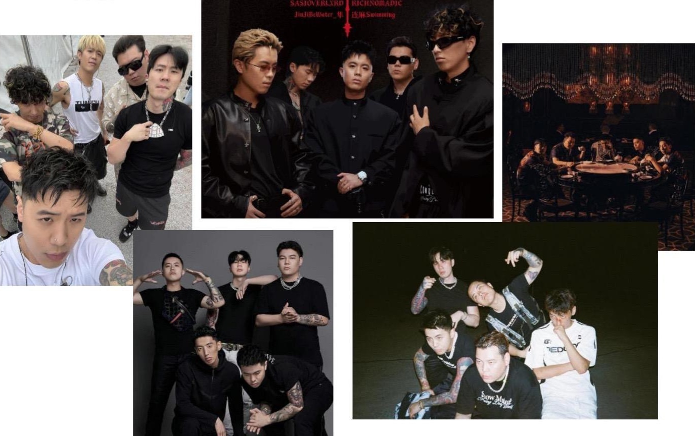

---

## 2020 年

2020 年 3 月，Capper 与陆政廷 Lil Jet 发生 beef，因为 Capper 和 Melo 走得很近，而连麻、Sasi、Gibb-Z 等人与 Melo 私怨已久，于是火速参战。连麻发布了对 capper 的 diss track《铲你猪脸》，并在歌词中 cue 到了 Melo，B站可听：[BV1Va411M7Uq](https://www.bilibili.com/video/BV1Va411M7Uq)，歌词在评论区。

> 注：依旧大量 curse words，注意避让。现在连麻、Sasi 和 Capper 都已和解，Capper 还关心过连麻的嗓子状况。

下半年开启了连麻的职业生涯中的重要时间段。6 月，声闻聚将担任芒果 TV 的说唱综艺《说唱听我的》的主办方，ICE 杨长青成为节目制作人之一。同厂牌的连麻、Gibbz- Z、JD 作为选手参与了比赛。连麻成功进入小鬼&袁娅维的队伍，并成为十一强。在十一进六的比赛中表演了歌曲《丢人吗》，虽然这个舞台因没有获得高票数而被淘汰，却成为很多听众心中的名场面。

注：隼上了舞台助阵，但其实并不是为了去助演，是妈妈看连麻瘦了好多让隼去看看连麻，再给连麻拿 500 块钱。B站可看现场：[BV19W4y1y7cf](https://www.bilibili.com/video/BV19W4y1y7cf)

这里推荐现场版是因为隼参加《新说唱 2024》决赛时的舞台有呼应。

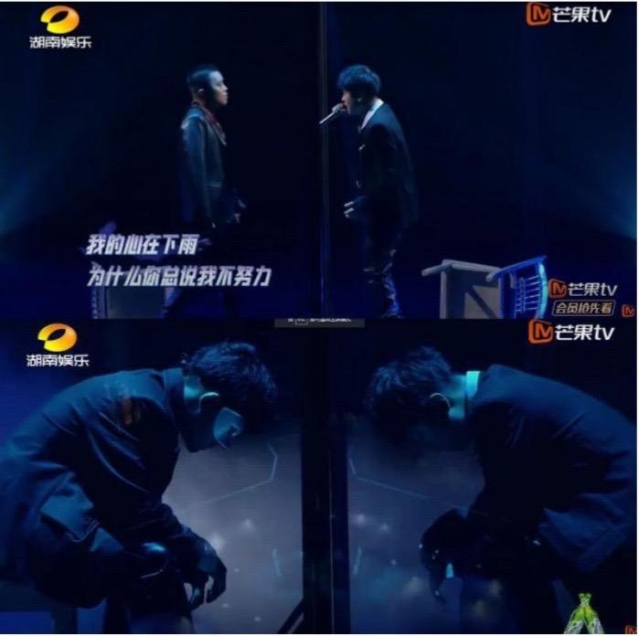2020 年 8 月 28 日，连麻发布个人首张专辑《Yuppie "雅痞"》，获得说唱圈内不错的口碑。

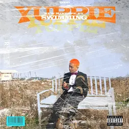

| 序号 | 歌名 | 备注 |
| --- | --- | --- |
| 1 | 林弯弯(Prod K eleven) | 评论区有 DJ BigCat 对于一些方言的解释 B 站可看 MV：[BV13V41177aG](https://www.bilibili.com/video/BV13V41177aG) |
| 2 | 鸿星尔克(Feat. |  |
| 3 | 锤子 (Feat. | 阿里嘎多摆锤子早有预兆（bushi） |
| 4 | shit 94 shit |  |
| 5 | 郑伊健(Feat.JR | 香港演员，代表作有电影《古惑仔》系列、《风云》 |
| 6 | Bow Bow (Prod. |  |
| 7 | 真资格 (Feat. 盛 | "盛宇带连麻"说法的出处 |
| 8 | 魔幻手机 | 2008年的同名电视剧讲述了来自2060年的幻幻手机机傻妞来到2006年结识陆小千等人，穿越时空，保 |
| 9 | rap 清明 rap 鬼节 | 本人本专最爱，且第一次听的时候，当天正好是 |
| 10 | 包剪锤(Prod. |  |
| 11 | 切得到 |  |

同年，坚决定回到成都继续说唱事业。Sasi 也在合约到期之后离开了声闻聚将厂牌。二人和 RICHNOMADIC 在成都八里阳光小区租了间房子，开始没日没夜地钻研作品。
11 月 13 号，6 点零 9 分，星曜五，四人没钱开锁被锁在了门外。
3 天后的 11 月 16 号，团队专辑《冰冷热带鱼》问世。

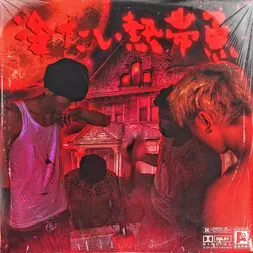连麻因为刚刚通过节目、专辑获得了一点的关注度，在忙着自己的巡演，所以只在专辑中和和隼。Sasi 合作了一首曲目《你要遭》。

> 注：被锁门时的珍贵影像：[BV1MS421o7EH](https://www.bilibili.com/video/BV1MS421o7EH) 娱播可看。\
> 传说最后是蝴蝶花项套现才有钱开的锁。\
> 冰冷热带鱼是日本导演园子温指导的剧情惊悚片（推荐喜欢看 cult 片和恐怖片的人），该片讲述了经营着一家小规模热带鱼店的社长，因女儿的盗窃事件与同行业的村田相识，不料却被卷入一场超越想象的离奇杀人事件中的故事。

---

## 2021 年

2021 年 3 月 2 日，五人发布了团队首支完全体单曲《我孝了》，B站可看 MV：[BV1AR4y1E7Rn](https://www.bilibili.com/video/BV1AR4y1E7Rn)

> 注：榨菜的 part 有藏语，直播注意规避。（不过以五人组的 mumble 程度，审核能听出几种语言的区别吗，或许只是想蹭字幕？这个交给 Afee 定夺）\
> 五人组之所以叫五人组而没有起名字，是因为之前加入的几个说唱团队，起了名字最后都解散了，Sasi 说下次再解散，没起名字就不算解散了。由于合体不多，听众还没有一个固定的五人组的慨念。

2021 年 4 月 19 日，隼发布首张个人专辑《树敌 SHOOTING》，收录了兄第二人的经典曲目《街头智慧》，QQ 音乐音可听。 B 站 可 看 MV ：[BV14y4y1u7TH](https://www.bilibili.com/video/BV14y4y1u7TH)

> 注：MV 中出演二人父母的，其实是他们的大舅和大舅妈。里面的水产市场是二人长大的地方。

在专辑中的曲目《SHOOTING STAR》中，五人再度合体。

2021 年 8 月 18 日，连麻发布个人第二张专辑《CHUNGWA》，QQ 音乐可听。

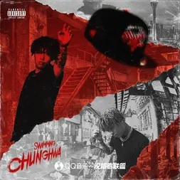

| 序号 | 歌名 | 备注 |
| --- | --- | --- |
| 1 | 还是闹以(prod Oakerdidit) |  |
| 2 | 三圣乡(prod Vickyferri) | 2 分 44 秒的声音来自刀脚，这是刀脚第一次从幕后混音师来到台前。 |
| 3 | 自立巷(prod RokitReady) | 现象级 track，MV：[BV1PP4y1b7Zx](https://www.bilibili.com/video/BV1PP4y1b7Zx) |
| 4 | 厚街(prod Vickyferri) | 五人组全员 |
| 5 | 县份说唱(prod.Waterboy) |  |
| 6 | 冰河时代(prod TriggaFZ) |  |
| 7 | 小麻(prod 黄河) |  |
| 8 | High Life (prod Timeline) |  |
| 9 | Why u do that shxt (prod HoodwithAnotha1) |  |
| 10 | Outro(prod 黄河) |  |

2021 年 11 月 22 日，连麻发布个人单曲《比心》，QQ 音乐可听。

---

## 2022 年

2022年1月1日，连麻，隼，Sasi助阵kkluv的Mixtape《诸神黄昏》,其中5首同名track都是使用了同一个伴奏，而连麻feat的版本获得了最高的热度。

2022年2月1日，五人组再度合体，发布单曲《Sin Cypher 2022》，B站可看MV：[BV1Va4112762](https:/www.bilibili.com/video/BV1Va4112762)

> 注：榨菜的part有藏语，直播注意规避。

2022年2月9日，连麻、隼、Sasi登上Mercy的访谈节目，18分钟， [BV1Ka41117ms](https://www.bilibili.com/video/BV1Ka41117ms)，其中谈到了五人组和DIGI GHETTO两个组合之间的竞争关系。三人则表示良性竞争是好事，组合之间也会互相欣赏彼此的音乐。Sasi则评价DIGI的作品更时尚，自己的更黑暗。弹幕也将两个组合比作中文说唱的漫威和DC。

2022年4月17日，连麻发布对Jony J的diss track《笑版阿特》，B站可看MV: [BV1tY4y1h7vJ](https://www.bilibili.com/video/BV1tY4y1h7vJ)

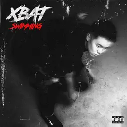注：阿特警官是孝感市公安局警察、哔哩哔哩UP主。第一人称视角拍摄的真实的执法现场等爆款短视频，让阿特警官收获众多粉丝。犯罪嫌疑人称经常刷到“阿特警官”的视频，让执法抓捕成为他的“粉丝”见面会。网友纷纷调侃称呼他为“抓粉丝的阿特”，同时，也正是越来越多的粉丝通过私信举报违法犯罪线索，成为了公安局的“粉丝天眼”。\
歌曲outro部分来自刀脚，刀脚2001年出生于贵州安顺，和混音师荨麻疹是老乡（和我也是）。少时热爱滑板，因受伤在修养期间爱上了说唱。认为自己很有Freestyle battle 的天赋，后参加贵州地区 battle 比赛一举拿下冠军。刀脚的名字是因为喜欢周星驰电影《逃学威龙》中的招数“夺命剪刀脚”。

2022 年 5 月 14 日，ICE 发布单曲《小李飞刀》，ft. 连麻、隼，B站可看 MV：[BV1zT4y1B77J](https://www.bilibili.com/video/BV1zT4y1B77J)

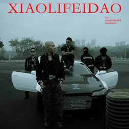

2022 年 8 月 6 日，mac ova seas、连麻 Swimming、SASIOVERLXRD、kkluv、艾志恒 Asen、那奇沃夫、CashTrippy 、斑比 Bambii 发布 cypher《P Cypher》

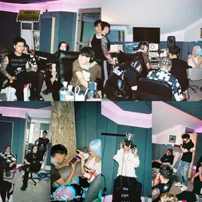

2022 年 8 月 12 日，连麻发布又一大热单曲《谭 sir》


注：谭 sir 指的是谭乔警官。《谭谈交通》是成都市公安局交通支队与成都市广播电视台联合推出的交通安全教节目，由原民警谭乔主持，以幽默风趣的执法风格闻名全国。节目于 2005 年 3 月 28 日首播，2018 年曾停播，2021 年 9 月 26 日正式完结，累计制作 3000 余期，衍生出多个全网热搜，最著名的是 "到二仙桥走成华大道"，源于谭乔与违规运载管材男子的骑骑对话。\
梗起源：[BV16i4y1V7wW](https://www.bilibili.com/video/BV16i4y1V7wW)，娱播可看。

2022 年 12 月 14 日，连麻和隼在生日这天发布联合 Mixtape《真假美猴王》，虽然只是 Mixtape，但姓孙的双胞胎兄弟和《真假美猴王》的概念浑然天成。

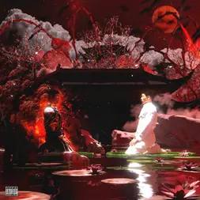

| 序号 | 歌名 | 备注 |
| --- | --- | --- |
| 1 | 真假美猴王               |  |
| 2 | 数钱的女孩 | 连麻写给自己老婆佳佳的歌，二人从高中开始相恋，直到22年结婚。她虽然不听说唱，但对连麻的说唱事业非常支持。 |
| 3 | 下水道蚂蚁 | 8平房子里的4个小子：划船兄弟&Gibb-Z 黄泽&阿清蚂蚁是几人曾经所在的说唱团体 ANT |
| 4 | 毛骗 | 讲述了一群各种骗术游走在城市间的边缘人物，以诈骗为生的同名古装网剧。虽然剧组很穷但是剧情超神。豆瓣评分第一季8.8，第二季9.5，终绪篇9.7，强烈推荐。 |
| 5 | 最终幻想 |  |

2022 年 12 月 16 日，五人组视觉项目《SINSHXT Vol.2》发布。其中包含 Sasi 的曲目：《死亡不是生命的终点》、《镜像人》、《OPPS》(ft.刀脚)；刀脚的曲目：《刀麻发鬓角》；RICHNOMADIC 的曲目《游牧主义》、《LIFE STYLE》、《SNOW MAKER》；连麻和隼的曲目：《真假美猴王》、《毛骗》、《下水道蚂蚁》\
B 站可看：[BV1jd4y1v7Vz](https://www.bilibili.com/video/BV1jd4y1v7Vz)

> 注：此项目一出，让刀脚立即成为当年最炙手可热的新人之一。《游牧主义》BAKO 的 part 有藏语，直播注意规避，其他两首首安全。

---

## 2023 年

2023 年 1 月，连麻和隼登上 SoulSenseTWH，表演《毛骗》、《下水道蚂蚁》，
[BV1cA411Q7Pn](https://www.bilibili.com/video/BV1cA411Q7Pn)

同时在 SoulSenseTWH 录制了 2 期总共 40 分钟的访谈
[BV1UV4y1F7a7](https://www.bilibili.com/video/BV1UV4y1F7a7)、[BV1ZY411Z7tZ](https://www.bilibili.com/video/BV1ZY411Z7tZ)\
1 期 13 分钟的喝酒闲聊节目 [BV1C14y1378K](https://www.bilibili.com/video/BV1C14y1378K)

2023 年 3 月 18 日，连麻、Sasi、刀脚发布合作单曲《YUNBABA》，B站可看MV：[BV1Da411o7ez](https://www.bilibili.com/video/BV1Da411o7ez)

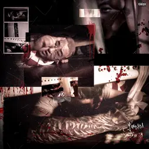

> 注：云爸爸是一个男装品牌，因为直播间的叔叔伯伯展示衣服裤子弹力的动作很有喜感，成为当年的网络热梗。MV 内有单腿露出。

2023 年 7 月，连麻、kkluv、Athree 助阵艾福杰尼,在《中国说唱巅峰对决 2023》的总决赛中，演唱《新纪元》《诸神黄昏》

---

## 2024 年

2024 年 2 月 14 日，连麻和刀脚登上社区 Rapper，表演曲目《不要装十三》、《哦》， B 站：[BV1J6421g7WY](https://www.bilibili.com/video/BV1J6421g7WY)

2024 年 3 月 1 日，五人组再度发布联合单曲《声色犬马》，B站可看 MV：[BV1Up4y1K7UC](https://www.bilibili.com/video/BV1Up4y1K7UC)

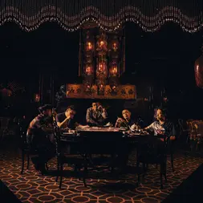

2024 年 3 月 29 日，连麻和隼助阵 Sasi 专辑《那小子真帅》中的曲目《胸弟》。

2024 年 4 月 12 日，杭异凡发布 ft.连麻的单曲《马兰开花二十一》

2024 年 5 月 18 日，连麻发布个人第三张专辑《邻家小丈夫》

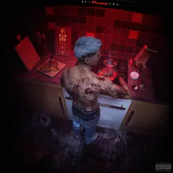

> 注：连麻在参加《说唱听我的》节目之前，是最穷困潦倒的时候，但也是过得最开心的时候。连麻每天 8 点起床开始做饭，一直到佳佳下班之前开始做饭。这段时间连麻成为了家庭主夫，结婚之后，家里也是连麻做饭做多，《邻家小丈夫》的名字或许由此而来。

| 序号 | 歌名 | 备注 |
| --- | --- | --- |
| 1 | 恶中之恶 | 同名韩剧讲述了在 1990 年代，为了推翻跨国毒品垄断集团，警察朴俊默伪装成权胜浩潜入毒品交易中心江南联合组织展开调查的故事。 |
| 2 | 超雄综合症 |  |
| 3 | 无良道长 | Ft.谢帝，MV：[BV1Ds421M7Xk](https://www.bilibili.com/video/BV1Ds421M7Xk) |
| 4 | 哦（That' it） | Ft.刀脚，专辑先行曲，MV：[BV1jm411f7hx](https://www.bilibili.com/video/BV1jm411f7hx) |
| 5 | 滑成宝马 |  |
| 6 | U Don' t Like Sh!t |  |
| 7 | 逆术家 | Ft. PlayerJ、阿牛、步步高先生 |
| 8 | 降级生 | 题目取材于连麻的真实经历，连麻在应该升入初二的年纪，被降级读了六年级。彼时隼在读初二。 |
| 9 | 舔狗 | 题目是连麻对自己高中时追了半年才追到女朋友佳佳的调侃。甚至call back到了上一首，虽然连麻比佳佳大，但是佳佳高二的时候，连麻高一。 |
| 10 | 漫长的季节 | Ft RICHNOMADIC，MV：[BV1Ew4m1S7kg](https://www.bilibili.com/video/BV1Ew4m1S7kg) |
| 11 | 镜像人 | 连麻直播时说是写给隼的 |
| 12 | 灯下黑 | MV：[BV1HU411f7Ln](https://www.bilibili.com/video/BV1HU411f7Ln) |

> 注：《漫长的季节》为同名电视剧，讲述了出租车司机王响的儿子多年前跟一桩命案相关，死于非命。因为一起意外的套牌案，逃逸多年的凶手再次出现在桦林、王响和他的老伙计龚彪、辞职的老刑警马德胜组成民间探案三人组，踏上寻凶之旅。本人心中中国近十年最好的电视剧，强烈推荐

专辑中有两首 ft. Sasi 的隐藏曲目。B站可收听
[BV1Zr421F7z5](https://www.bilibili.com/video/BV1Zr421F7z5)，评论区有歌词。
[BV1K7421o7qe](https://www.bilibili.com/video/BV1K7421o7qe)，采样了美剧丧尸片《行尸走肉》的片头曲。

之后，连麻没有再发布个人单曲和专辑，只用 feat 和现场和听众见面。

2024 年 7 月，隼参加《新说唱 2024》获得冠军，总决赛上连麻和隼演唱了《下水道蚂蚁》，五人组完全体演唱了《声色犬马》，刀脚依旧担任着小宠物的角色。 B 站可看：[BV14E421w7yJ](https://www.bilibili.com/video/BV14E421w7yJ)

> 注：节目上的歌曲名叫《拳头》，来自于电影《艋舺》"五根手指合起来，才是一个拳头"。连麻和隼的舞台和 4 年前的《丢人吗》形成互文。隼也在后来中对连麻喊话："不丢人。"

一个搞笑视频，娱播可看：" Kanye west 神级采样刀脚 "[BV12Z82eyEHZ](https://www.bilibili.com/video/BV12Z82eyEHZ)

2024 年 11 月 13 日，Gibb-Z 黄泽 ft.连麻发布《轮到我》，收录于黄泽个人专辑《都在》中。歌词中再次致敬了二人早期说唱团体 ANT。

2024 年 12 月 24 日，希希.ft.连麻发布《也没得撇子》，收录于希希个人专辑《桀骜公子哥》中。

---

## 2025 年

2025 年 5 月 8 日，布瑞吉 ft.连麻发布《顶梁柱》，收录于布瑞吉个人专辑《一脉相承 Hood & Family》中。

2025 年 6 月 28 日，刀脚 ft.连麻& popogo & V DUGG 发布《踹门抓小三》，收录于刀脚个人专辑《脚殺传》中。

同一天，连麻作为首位嘉宾，登上热单间 Heatroom，表演了 3 首全新编曲的经典曲目：《谭 sir》《下水道蚂蚁》《数钱的女孩》。\
B站可看：[BV1YWKrzzEi7](https://www.bilibili.com/video/BV1YWKrzzEi7)

2025 年 8 月 23 日,谢帝 ft.连麻发布《土壤》,收录于谢帝个人 Mixtape《Couple Hunnid All Star Mixtape Vol.1》中。

2025 年 8 月 29 日，张方钊 ft.连麻发布《尴尬的》，收录于张方钊个人专辑《钱专》中。

2025 年 8 月，刀脚和连麻助阵 DDG 邓典果，在《新说唱 2025》的总决赛上，演唱《哦》。注：改词太多，不推荐。

连麻也成为一位虽没有参加节目，但连续三年登上总决赛舞台的 rapper。

---

## 2026 年

2026 年 4 月，连麻在北京 club 商演中表演了新曲目。或许新专辑会很快到来。

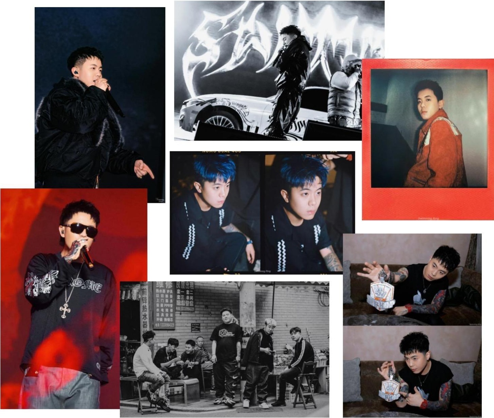

最后，特别鸣谢龙龙 Sivin（发梦版）老师用心制作的连麻 swimming 开荒人物志文稿稿，向老师表达由衷的感谢！

